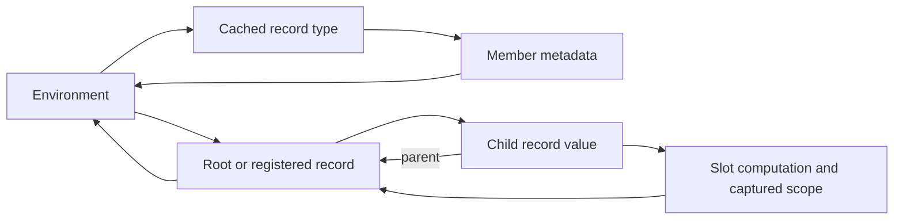

# Runtime cost and ownership diagnosis

Source baseline: `1a76e625` (2026-09-12). Sections 1–6 record the original
investigation and its private experiments. Sections 7–10 record subsequent
implementation steps. Observable behavior and the frozen specification are unchanged.
External models, profiles, and engine comparison reports remain
outside this repository, as required by [the measurement policy](DEVELOPMENT.md#performance-measurements).

The current engine already shares Programs, retains eligible reference rounds,
and cuts off propagation when results are equal. The remaining costs include
work performed before those query bodies run and after their results are ready.
A count of executed queries therefore does not measure an entire operation.

## 1. Measure disjoint stages

Separate source loading/checking, input binding, evaluation, reference settlement,
retained-round transition, final validation, output conversion, file writing,
and object destruction. A settlement timer is inside evaluation; serialization
and typed JSON reading are inside emission. Subtract measured children from
their parent before adding stage contributions.

For a Session update, measure apply, preparation, evaluation/validation, and
serialization separately. A hot Run retains the previous Run's internal timing
record; use a timer around the public request. Full-recompute mode can evaluate
the old document while evaluating an edit expression and evaluate the updated
document again during run. State both boundaries when comparing it with reuse.

Keep repeated uninstrumented latency samples separate from diagnostic runs.
Peak RSS under compression/swap is not allocated bytes or logical heap size.
Neither a timeout nor an out-of-memory failure supplies a completion time.

## 2. Edit preparation revisits overlapping value subtrees

In [Edits.begin](../decl-ts/src/qengine/edits.ts), every invalid producer can
recursively collect the member keys below its previous value. The outer
`invalid` set avoids processing a query key twice, but each producer creates a
new descendant set and traverses its value before the queued keys are deduplicated.
Overlapping parent/child values can therefore be walked repeatedly.

The cost follows the sum of the traversed subtree sizes, not just the number
of invalid queries. A deeply nested value tree can make that sum quadratic.
Deduplicating the final key set does not remove the traversal that constructs it.

A private experiment used one object-identity visited set for the entire
invalidation walk. It preserved the prepared and executed query counts and
produced identical output, while substantially reducing repeated traversal.
This isolates redundant preparation from useful recomputation. It is not a
proof that the prototype covers every language case or improves peak memory.

For an implementation change, preserve the walk's read-only value boundary,
direct-input diffing, canonical paths, and frozen owners. Exercise shared values,
structural insertion/removal, absent members, references, diagnostic recovery,
and fresh-versus-retained evaluation. A visited set for each individual producer
would still repeat work across producers.

## 3. Aggregate observations have two independent problems

[Engine.equalValues](../decl-ts/src/engine.ts) observes records under both operands
before comparing them. Comparing an array containing records with `null` records
aggregate reads even though that comparison does not inspect record contents.
Operand evaluation and its ordinary dependencies remain necessary; those
content observations are a separate concern.

When any `value:` dependency exists, `Edits.begin` puts all saved values into
its preparation queue. That fallback applies even when the aggregate reader
belongs to an unrelated root. This is broader than following the dependencies
of the edited member.

The independently authored [aggregate diagnostic](../tests/benchmarks/README.md#aggregate-observation-diagnostic)
binds 5,000 three-member records,
edits one supplied integer, and exports a scalar sum. An additional output
compares an unrelated record with null or with itself. Two warmups precede five
measured edits in the TypeScript reference; every scalar result is checked.

| Additional observation | Prepared queries | Executed member queries per edit |
|---|---:|---:|
| Constant boolean control | 7 | 5 |
| Unrelated record compared with null | 15,009 | 5 |
| Unrelated record compared with itself | 15,009 | 5 |
| Null comparison with unnecessary aggregate observation omitted in a private experiment | 7 | 5 |

The null case can avoid an unnecessary observation. Genuine structural equality
still needs a dependency-scoped representation of the aggregate it observed.
Removing the null observation alone is insufficient for programs whose
record-producing roots or frozen-reference dependencies independently reach
most of the graph. Maintain reverse edges and narrow producer boundaries as
separate experiments; do not assume one change removes all preparation.

## 4. Rust ownership contains multiple strong-reference cycles

The Rust Engine already installs its evaluator hooks through weak references.
The unresolved ownership paths are elsewhere:

[Env.type_memo and Member.menv](../decl-rs/src/semantics.rs) form a cycle even
without a runtime record: `fill_record` stores a strong environment reference
on resolved member metadata. Runtime roots/registry, record environments,
parent links, and captured scopes add other paths.

A synthetic probe retains only weak references after dropping Session and Run.
It then removes individual ownership edges from the otherwise abandoned graph:

| Case | After Session/Run drop | Further cuts required in the probe |
|---|---|---|
| Scalar output, no resolved record type | Engine and environment released | None |
| Scalar output after resolving one named record type | Engine released; environment remains | Clearing the type memo releases it |
| One flat record output | Engine released; record and environment remain | Clear the type memo, then runtime roots/registry |
| A record containing one child | Engine released; both records and environment remain | The preceding cuts and parent cuts are insufficient; clearing slot computations releases the graph |

These destructive cuts run only after evaluation in a private ownership probe.
They diagnose the cycle; they are not a proposed production cleanup routine.
They establish retained ownership on these cases, not a byte count or a cause
for every capacity failure.

Define a strong owner for a universe/run and each frozen snapshot. Use weak
back-references or arena identities within that ownership boundary, including
captured scopes and type metadata. Changing only `parent` is insufficient.
Changing every reference to weak ownership without preserving the lifetime of
returned values, imported modules, and frozen snapshots would also be incorrect.
Auxiliary cache-size regressions do not prove that the surrounding object graph
is released; add explicit lifetime checks at the public-owner boundary.

TypeScript's tracing GC and Python's cyclic GC have different collection
behavior. For Python, distinguish evaluation-time collection from the cost of
reclaiming unreachable cycles after the command body returns. An explicit GC
diagnostic can locate that work; suppressing finalization is not a production fix.

## 5. Rust recompiles the numeric JSON regex per number

The recursive numeric branch of [read_json](../decl-rs/src/semantics.rs) calls
`Regex::new` for each token. The pattern is invariant. The plain emission path
serializes an engine value, reads the resulting JSON back into typed values,
and renders it, so the problem also applies to the completed output.

Caching the compiled expression removes repeated compilation while preserving
the pattern and capture rules. Compilation count changes from one per number
to one per process; parsing still requires work proportional to its input.
Python already uses a module-level compiled numeric expression.

Keep regex lifetime and direct output emission as separate changes. A direct
canonical JSON path must preserve integer/decimal distinctions, escapes, order,
newlines, diagnostics, and the other renderer modes. Use shared numeric JSON
cases and the existing parity gate, not only a large valid document.

## 6. Priorities and acceptance

1. Fix invariant regex compilation independently; verify exact output and
   numeric edge cases.
2. Correct Rust ownership at universe/run/snapshot boundaries; verify that
   inaccessible graphs are released, including types with no record instances.
3. Remove overlapping invalidation walks without changing the candidate set;
   then reduce aggregate and producer granularity with separate evidence.
4. Reduce old-value capture and per-instance slot/value metadata once allocation
   measurements identify their owners and required lifetimes. Shared Programs,
   Python `__slots__`, Rust shared paths/strings, and mimalloc already exist.
5. Consider scheduler identities and durability after measuring the remaining
   verification cost. A standalone query-database comparison does not include
   language binding, record construction, reference rounds, or full export.

The first three diagnoses have concrete code paths and isolated experimental
evidence. Broader representation changes remain design work. Each production
change needs relevant shared correctness cases and the repository's full
verification/parity gate. At diagnosis time, the private experiments had not
implemented those production changes; the completed follow-up is recorded below.

## 7. Implemented follow-up

The follow-up implements the invariant Rust numeric regex cache, a shared
object-identity visited set across each edit's invalidation walk, and
per-revision memoization of comparison snapshots. Immutable record paths are
formatted once per record in preparation rather than once per member. Each
snapshot is captured before any slot is mutated; its temporary index is released
after preparation.
The three implementations preserve their existing identity, path, slot-kind,
optional-presence, and frozen-owner comparisons.

Equality records aggregate content observations only for matching record,
array, or map operands. A null comparison and a reference/path comparison do
not observe container contents. Preparation resets the recorded aggregate
subtrees and follows their readers, instead of resetting every saved value.
An aggregate whose record is outside the current registry keeps the old
conservative fallback. Frozen/reference observations and broad expression
producers still require separate granularity work.

The Rust representation now tracks environments, records, and potentially
recursive types with weak handles. Its cycle collector enumerates owning Rc
edges, subtracts those internal references, and preserves every node reachable
from an unaccounted external owner. Shared containers, type members, captured
locals, module imports, and recursive types are separate identity nodes, so an
edge is counted once per actual owner rather than once per traversal path.
An uninspectable borrow or an opaque callback is treated conservatively through
external ownership; collection does not evaluate language expressions.

The last Engine and the outer CLI command trigger collection after releasing
their own fields. The public Rust `semantics::collect_cycles()` operation also
allows an API caller to reclaim cycles after releasing bare values or types
that outlived their Engine. Returned values and resolved types remain intact
while their caller owns them. This preserves existing strong-reference APIs;
it does not replace the complete runtime with an arena or weaken parent and
scope links. Opaque callback ownership may conservatively retain a graph.
Sweep time, transient memory, and live-engine collection frequency remain
performance considerations. Weak tracking handles also keep the Rc allocation
block reserved until the tracker prunes them, even if its value has already
been dropped. The current automatic boundary is the last Engine, not every
edit; long-lived sessions and concurrent owners require separate steady-state
allocation measurements and may benefit from cheap dead-handle pruning.

The Rust API driver verifies recursive type lifetime, abandoned scalar/flat/
nested/contextual runs, caller-retained values, an active borrow, and a Run
containing frozen reference snapshots. Shared `edits.json` cases verify bounded
preparation for unrelated null/self comparisons, nested and replaced record
comparisons, and aggregate observations combined with reference rounds. The
existing full verification and parity gate remains the behavior criterion.

The implementation passed `make verify` (1,277 identical parity judgments,
zero differences) and `make lint`. Performance evidence distinguishes complete
CLI process time from individual Session requests and from instrumented stages.
Fewer snapshot constructions do not alone establish faster preparation: pending
query entries and copied dependency sets remain separate costs. Similarly,
reclaiming abandoned runs does not reduce the live graph required by a single
large evaluation.

Full external-workload before/after measurements are recorded outside the
repository under the measurement policy above. The changes do not by themselves
establish faster initial evaluation in TypeScript/Python or increased capacity
for every large document. In particular, snapshot memoization and invalidation
walk changes target Session updates, while broad root producers and repeated
binding remain further optimization candidates.

## 8. Avoid unused Rust descriptor copies and slot capacity

`Engine::force_slot` now clones its optional `Compute` after cached, deferred,
and cycle returns. Its owned member/root names and supplied value are needed
only by actual computation. Owner routing, dependency recording, reference-round
value adaptation, absent-value acceptance, and diagnostic order stay in place.
The descriptor borrow ends before execution, so recursive evaluation can still
mutate slot state. Descriptor cloning and the transition to Forcing use one
mutable slot lookup; delaying a clone must not add another linear name scan on
the uncached path. TS/Python already retain a callable reference here; there is
no equivalent owned descriptor clone to remove in those implementations.

`Engine::bind_record` reserves the known member count in the new slot vector.
Each schema member contributes one slot, including absent and invalid members.
Rebinding still preserves the old vector for `Edits::bound`; reservation does
not reuse or overwrite that evidence. Exact capacity removes geometric vector
slack, but does not remove per-slot descriptors, names, values, or frozen copies.
Allocator rounding and the rest of the live graph prevent equating vector
capacity savings with an equal reduction in process RSS.

These two changes are separate performance interventions. The comparison uses
four frozen binaries (before, each individual change, combined), then a larger
before/combined confirmation. Output bytes and diagnostics must agree in every
accepted attempt; instrumented storage counters remain a separate series.

At this checkpoint, representation candidates included typed query identities,
shared schema member-to-ordinal lookup, immutable descriptor plans and compact
frozen slots. Rust record lookup scans its ordered slot vector; existing
Programs share member definitions but do not yet provide ordinal lookup. The
read sets and slot index still owned full string keys before the migration in
section 10. These are specific
gaps, even though shared paths, Programs and faster tables exist elsewhere.
Rust's public record and engine fields also impose an API compatibility boundary
on such migrations; CLI parity alone cannot prove source compatibility.

The next query-storage follow-up removed Rust's second dependency-set copy
during verification while retaining the preparation copy. Section 10 then
shares the preparation snapshot as well; neither step narrows invalidation.

The [comparison procedure](../tests/benchmarks/COMPARE.md) records hypotheses,
frozen artifacts, accepted/failed attempts and paired process observations.
Use small causal diagnostics before promoting a change to larger capacity tests;
do not rerun an unchanged full cross-language matrix for every host-specific
representation experiment.

## 9. Share temporary query storage

This intermediate step precedes the authoritative ID graph in section 10.
Its remaining String ownership and public-field compatibility describe that
checkpoint, not the later representation.

Rust's edit and reference-round preparation now builds reverse adjacency from
borrowed dependency and reader text. The temporary graph and its source borrow
end before revision preparation, freezing, or dependency replacement. The
invalidation queues and retained public maps still own strings. Previously,
`entry(dep.clone())` allocated a dependency string on every edge, even when the
map already held that key, and each reverse edge copied its reader string.
Borrowing removes these character-buffer allocations and shortens the reverse
graph's lifetime; it does not eliminate constructing or traversing the graph.

Rust's private Pending table now shares each snapshot through `Rc`. Recursive
verification keeps the pending marker until all former dependencies have been
checked, with owners before their contents. A verified cutoff then removes the
marker and moves the original dependency set back into the read table; a retained
alias uses the conservative clone fallback. Recomputed queries still replace
their read sets with newly recorded dependencies. A `Cell<bool>` preserves
forced invalidation while the snapshot is shared. This avoids the previous
second deep copy at compute entry, including queries already marked forced.
Preparation still takes the first snapshot and now allocates one Rc per Pending,
so reduced copying alone does not prove lower preparation time or peak RSS.

Occupied Rust read and revision-stamp entries update through borrowed keys.
The read-table owner or change-stamp key is copied only for a newly inserted
entry; incoming dependency strings and their set insertion are unchanged. Python's fixed-field
Pending dataclass uses slots; its dependency set and values keep their existing
ownership. TypeScript already references these objects and sets, so it has no
corresponding deep-copy or instance-dictionary intervention. These are internal
representation changes, not different language behavior or a migration of the
public Rust engine/record field types.

Validate initial, cached, equal-result, changed-result and restored requests.
Distinguish the number of independent wide aggregate queries from each query's
dependency degree. Every exported result and diagnostic stream must agree;
total-only checking can miss a broken secondary aggregate. Revision and slot
execution counters are cumulative within their retained owner: record per-request
deltas and verify that owner identity persists. Preparation counts describe the
latest edit, not a cumulative count. Graph scans and instrumentation run outside
primary request timers and in a separate diagnostic series.

Use each fresh process as a comparison replicate; repeated edits inside it are
nested observations, not independent process samples. Alternate before/after
order and retain all accepted observations. Report application, evaluation and
serialization boundaries as well as whole-process RSS/CPU separately. Fixed-field
object population measurements establish storage savings for that population;
they cannot be extrapolated directly to the entire Session or its process RSS.

## 10. Canonical query identities and shared read sets

Rust now uses one authoritative ID graph for Engine read owners, dependency
members, indexed slot keys, the computation stack, and private revision maps.
A query identity shares its text and caches its text hash. Equality first checks
identity and then exact text with the cached hash, so equal text from separate
pools remains equal. Ordering remains lexical. The ID hash encoding differs
from `str::hash`; the ID deliberately does not implement `Borrow<str>`. Textual
callers resolve through the pool, while internal callers that already own an
ID query the corresponding maps directly.

The pool holds exactly one canonical ID per spelling. A live graph,
computation, Pending entry, or frozen snapshot owns additional handles; an ID
has no reference back to an Engine, pool, or runtime value. Engines within one
evaluation lineage, including retained and fallback rounds, share the pool.
Older runs can legitimately keep identities alive, so pool counts can exceed
one Engine's current graph. An identity handle and cached hash add storage per
unique key while removing repeated owned character buffers. The balance depends
on key length, repetition, and dependency degree; canonicalization alone is
not evidence of lower total memory for every graph.

The interner uses a hash table with caller-supplied hashes. A normal lookup or
insertion hashes the text once and uses one table entry probe; growth and
shrink reuse the stored text hash. The earlier text-to-weak map hashed a fresh
spelling for lookup, cached-hash construction, and insertion. The new table
stores only the thin ID, reducing its element payload from 24 to 8 bytes on
64-bit targets without widening graph IDs. These payloads exclude buckets,
allocator metadata, and the key/text allocations, which still exist.

A pool-only entry is logically dead even though the table keeps its canonical
allocation. Lookup checks ownership before cloning and does not revive such
an entry; interning can reuse it without another allocation and counts that
revival toward maintenance. At a sweep threshold, the target is removed
before scanning and reinserted afterward so it does not inflate the prior
live-population count. Census and retention inspect borrowed handles, because
cloning for observation would create false liveness.

An empty `ReadSet` has no set allocation. A nonempty set shares its body through
`Rc`, and preparation clones that handle into Pending instead of copying every
dependency. Fresh computation replaces the owner's read-set handle at the
existing capture boundary. A writer uses copy-on-write if another snapshot
still holds the body. Verified cutoff moves the prior snapshot back after
recursive dependency checks. Equal recomputation retains the old change stamp
but keeps the newly recorded dependencies; equal values can have different
read sets. Partial reads on an ordinary error, absent versus retained-empty
owners, owner-first verification, and pending membership during verification
keep their previous semantics.

Revision methods now carry their entry identity through read lookup, slot
lookup, restoration, and change-stamp updates. For an eligible owner,
`begin_queries` changes from three logical pool calls to one, and `begin` from
four to one. A verified cutoff and successful equal-result recomputation each
change from three to one, excluding callbacks and recursive dependency work.
These are source-derived call counts, not measured hash probes or timings.
The default slot resolver can use the dependency ID directly; the custom
resolver retains its text boundary. Map hashing, reference-count updates,
invalidation walks, and query programs still cost work.

Actual member forcing also carries one identity through slot registration,
the computation stack, and revision computation. Previously each of these
boundaries interned the same textual key independently. The producer chain
now makes one interner call instead of two, or three when revision computation
is active. When a tracked parent reads an unforced slot, its recording helper
now returns the recorded identity for that same producer chain and retains
the already formatted slot key. This removes the second key formatting and
interner call on that eligible path. Verification-suppressed reads retain no
parent dependency; the producer still obtains its own identity at the existing
forcing boundary. Cached, deferred, cyclic, and frozen-owner paths keep their
original ordering and recording behavior. This does not remove the first key
allocation, change query granularity, or store an ID in every member slot.

### Cleanup at the correct lifetime boundary

Unconditionally scanning the full live query pool after every small scratch
expression makes a local request pay for the universe's pool size. The Rust
Session coalesces those scans until 1,024 identities have been created or
recreated since the last actual sweep. Live-key hits do not advance that count
or scan the pool. Missing or expired intern entries can trigger an automatic
sweep at a live-population-based size threshold.

A creation count alone is insufficient: a scan in the middle of a large
request resets the count while retaining that request's still-live identities.
An explicit flag remembers this in-flight sweep, forcing completion maintenance
after temporary slots, read sets, fallback roots, and change stamps are removed
or restored. Thus a large request's final cleanup does not depend on how many
additional identities it created after the last automatic scan. Ordinary
error results follow the same scratch cleanup path. This does not introduce
a general panic-unwind recovery contract.

Evaluation completion still explicitly sweeps after releasing its previous
round owner. Sweeping only removes entries whose sole owner is the pool
and shrinks substantially excess capacity. Small requests can leave dead text
until a later maintenance boundary; this is not a universal fixed-byte bound.
Old Run retention and value/type cycle collection have separate lifetimes.

### Scratch graph scans and prefix checks

Coalescing identity-pool maintenance alone left four whole-map passes in
`Session::scratch`: filtering the slot/read maps before an expression, then
cloning both key lists for removal afterward. It also cloned the registry to
obtain its length and formatted every instance path during cleanup. None of
that work depended on how many temporary entries a scalar expression created.

The Rust `under(path, root)` predicate previously constructed `root + "."`
and, when needed, `root + "["` for each non-equal path check. It now borrows the
suffix returned by `strip_prefix(root)` and accepts only an empty suffix or
one beginning with `.` or `[`. Equality, member descendants, and indexed
descendants keep their previous boundary rules; a merely similar prefix is
rejected. This allocation-free predicate reduced per-visit cost; by itself it
did not remove any full-map pass.

Scratch now uses a separate weak index of only underscore-eligible query IDs.
The pool appends an entry when it allocates a fresh eligible key, never on a live
hit or pool-only revival. Existing sweeps and subset enumeration prune expired
weak entries. Before evaluation, Session looks up those candidates in its own
maps to snapshot existing entries; keys held by old Engines in the same pool
need not belong to the current graph. Without a newly demanded fallback root,
post-evaluation cleanup visits only this subset. Temporary candidate handles
drop before completion maintenance, so enumeration cannot keep them alive at
that boundary. The index neither duplicates text nor changes QueryId's layout.

The slot predicate uses the raw path; read owners strip at most one `assert:`
prefix. Thus `assert:_.x` can be a removable read owner while a raw slot with the
same text remains outside the underscore slot predicate. `root:_` and `_other`
are excluded. Existing real underscore roots still require snapshot/restore.
A newly demanded fallback root retains complete graph scans and the original
key snapshots for its arbitrary name. Both branches remove all temporary read
owners before dropping any slot value, with the original per-key borrow scope:
destroying an instance can drop a public Bridge callback's user-provided capture.
Ordinary error cleanup preserves the same predicates and restoration boundary.

Registry length is read without cloning record handles. If no fallback root was
newly demanded, cleanup preserves the existing numeric prefix and tests only
the appended tail for a leading underscore name segment, without formatting
paths. Clamping the prefix to the current length preserves the old behavior
when a caller publicly replaces the registry. With demanded roots, all current
registry paths are still inspected, including publicly changed old instances.

Remaining whole-universe work must be measured separately: `Edits::prune` still
clones the current registry to build its live-address set and scans cached input
descriptions and roots. Existing pool budgets can still trigger a complete
identity sweep. A real underscore root or retained old Engine can also keep the
weak subset large. The common path is narrower, not universally constant-time.

These changes are separate from pool cleanup frequency. Unchanged
prepared/executed-query counts or unchanged graph population cannot establish
that the same preparation work took the same time. Compare scratch request
boundaries and allocation/profile evidence separately, with identical output
and diagnostics; retain the scan count and pool-maintenance policy in the
experiment description. Prefix-boundary correctness also includes empty and
non-ASCII roots, without imposing new assumptions about caller text.

### Assertion-free validation

Validation visits every registered instance, including records with no
assertions. Previously those empty visits still formatted an assertion key,
interned an identity, entered the computation stack, and built a scope and
diagnostic path. With a round cache, an empty visit retained no read owner, so
its new identity could immediately become a dead weak-pool entry. Final
validation runs after evaluation's completion sweep; such entries could also
make a later scratch request perform pool maintenance.

Rust now skips scope and stack construction for an empty assertion list.
Untracked validation returns immediately. Tracked validation preserves the
previous graph reset: with a round cache it removes an existing owner through
a lookup that does not intern a missing key; without a round cache it retains
an explicit empty read set. It leaves other owners and existing diagnostics
alone. The assertion list is read afresh because the public record type can
be mutated; nonempty assertions follow the original evaluation path.

This removes representation work, not language validation. Rust API tests
cover absent, empty, and populated prior owners in every tracking/cache mode,
plus assertion removal/restoration and ordinary-error dependency capture.
Lower dead-key counts are an expected storage consequence, not a change in
logical dependency edges. A complete-process comparison is still needed to
determine whether this bounded change resolves cold execution overhead.

### API and verification boundaries

The Rust `reads`, `slots_by_key`, and `computing` fields are now crate-private.
This is an explicit source API break. The
[migration guide](QUERY_GRAPH_MIGRATION.md) provides counts, sorted owned-text
exports, an ordered stack export, a live slot lookup, and a numeric storage
census. A second mutable String graph would preserve the storage and permit
uncoordinated writes; the implementation keeps a single authority. Public
record slots remain unchanged. TypeScript and Python retain their idiomatic
representations, and all three retain the same language and CLI contracts.

Use the shared equal-result dependency-switch case alongside error recovery,
owner removal/recreation, and reference-round cases. Rust-specific checks cover
cross-pool equality/hash consistency, snapshot copy-on-write, pool-only key churn,
owned API exports, and large temporary requests whose identities survive an
in-flight sweep. Private Rust checks also cover weak-subset boundary selection,
revival without duplicates, old-Engine membership, public registry/path mutation,
and tail cleanup that never borrows preexisting records. Their local success does
not replace the complete parity and
lint gate required for landing.

Measure request latency separately from storage census and graph export.
`query_storage` inspects the current state without pruning: pool counters cover
the lineage, while read-body and index counters cover the inspected Engine.
It deduplicates bodies present in that Engine's read map, not bodies retained
solely by Pending or other Engines. Usable capacity and struct/text payloads
exclude allocator overhead and must not be reported as RSS or whole-heap size.
The `scratch_index_*` fields report a separate raw weak Vec's entries, capacity
and weak-handle size; they do not count current read owners or retained text.

Canonical IDs, shared read sets, coalesced maintenance, ID propagation,
allocation-free prefix checks and narrowed scratch cleanup are separate
interventions. A combined before/after result measures the bundle;
an isolated variant or separate work/profile evidence is needed to attribute
an effect to one component. Keep each failed or superseded attempt, declare
its reason, and validate every fresh output before accepting any measurement.
External workload timings and capacity results remain outside the repository.
This section describes the mechanism and acceptance conditions; it does not
claim a new overall speedup or a completed final verification gate.

## 11. Compact output emission

A selected root's plain compact JSON output previously went through three
representations: `Engine::serialize` produced canonical text, `read_json`
allocated a raw document from that text, and the renderer serialized that
raw document again before adding a newline. This output work is separate from
the engine's binding, reference rounds, and final validation. Removing query
lookups alone does not remove the renderer's extra traversal and allocation.

Rust's non-template JSON emission now reuses the canonical text when the
resolved indentation is zero. It still serializes once at the same point and
adds exactly one trailing newline. The same rule applies to each fan-out item
after every destination path has been validated. Empty canonical text from
an unsupported public Value follows the existing decode failure path; an
actual empty-string document is valid JSON and uses the fast path. YAML,
indented output, and templates retain their format-specific processing.

This optimization covers selected-root emission, including `--output oid`.
The CLI's aggregate output without an explicit target has a separate document
assembly path. Report emission time separately from evaluation time and avoid
claiming that faster output fixes every internal evaluation cost. Use the
shared render/CLI/golden corpora and byte-for-byte parity, plus the Rust public
Emission invalid-value regression, to preserve output and failure behavior.

## 12. Streaming canonical serialization

Reusing canonical text in the renderer removes an output conversion, but the
engine must still construct that text. Previously each recursive serializer
returned a subtree String; containers collected those results in vectors,
joined their bodies, and allocated surrounding JSON text. Rust now appends
into one owned result String per serialization. Container checkpoints remove
the separator and key when a typed child has no document representation.
String and key escaping append directly; integers use their existing Display
implementation, while float and reference-path formatting retain their prior
helpers. Record entry-name membership borrows names under the existing record
borrow instead of cloning each String. The result buffer can still grow and
formatters still allocate; this is not an allocation-free traversal.

This change deliberately does not cache Session output. Rust callers can
mutate public record slots and extras, array items, map entries, and the
environment's base-unit metadata without advancing a Session revision. Raw
documents can also contain `PreVal` expressions whose evaluation reports
diagnostics or reads dependencies each time serialization runs. An identity
or revision keyed result cache could return stale bytes or suppress those
effects. A general result cache would need an explicit mutation/invalidation
contract, or a content check that itself traverses the value. Fresh traversal
preserves the current public contract.

The writer keeps document-entry order followed by eligible schema members,
the settable-only projection, and existing hidden/invalid/absent checks. Typed
unsupported values are omitted; raw unsupported values and failed raw PreVal
results become `null`. Top-level unsupported values still return empty text.
PreVal callbacks retain their left-to-right order and exactly-once execution
per visit, including continuation after an ordinary failure. The same immutable
RefCell borrow spans each record, array, or map traversal, and schema members
are still obtained after the record's document entries. Direct appending does
not introduce a new mutation or panic-recovery boundary.

The Rust public API regressions exercise mutation between serializations,
raw callback effects and dependency capture, projections, and directly
constructed numeric/string boundary values. A shared render case combines
explicit zero-indent selected-root output and no-template JSON fan-out, with
large integers, finite float extremes, control/Unicode escaping, quantities,
empty/null values, and hidden/optional omission. Existing shared expectations
remain unchanged; byte-for-byte parity and the complete gate are still required.

Measure serialization churn and latency separately from evaluation and from
the earlier compact-emission conversion removal. Requested allocation bytes
and allocation-call counts describe churn; they are not latency shares, RSS,
or allocator-resident memory. Record the live allocation population before
serialization and its additional peak. Eliminating intermediate output buffers
does not release the already retained records, slot descriptors, values, and
query graph that form the evaluation working set. Those owners remain a
separate investigation, and an overall improvement must be established by
validated end-to-end measurements. Host-specific results remain external.

## 13. Measuring temporary-query cleanup

Count scratch administration separately from expression evaluation. Before the
subset change, the two pre-expression filters visited every slot/read entry;
the two post-expression map traversals cloned every key. The subsequent removal
loops checked those cloned keys again. A report that adds pre-map visits to
post-map clones describes those counted map operations; it must not imply that
the later vector-prefix tests were also independently counted.

For the narrowed implementation, distinguish weak-index pruning/upgrade visits,
current-map lookup candidates, actual underscore snapshots, newly demanded
roots, appended registry entries, and full fallback-root scans. The raw weak
index may include pool-only IDs and IDs held by old Engines; its size is not the
number of current graph owners. A zero-demand request with an empty underscore
subset should do no full slot/read scan or preexisting-registry path formatting.
This expectation describes the cleanup branch, not all work performed by the
request.

Keep `Edits::prune` and identity maintenance visible. Edits pruning still clones
the current registry, builds its live-address set, and scans cached input and
root descriptions. Pool maintenance can scan all retained identities when its
existing budget or in-flight-sweep flag requires it. Root-name snapshots and
diagnostic truncation are additional administration. Public registry/root
mutation prevents assuming that old cached descriptions remain valid merely
because a temporary expression created no new root.

Allocation tags should separate these administrative costs from nested
expression work. Report allocation/reallocation calls, gross requested bytes,
live-byte change and peak separately: a high gross-byte share is not a latency
share, and allocator requested bytes do not measure physical RSS. Collect work
and allocation counters in a separately instrumented diagnostic build, then use
the uninstrumented release binary for the fixed before/after timing schedule.
Every diagnostic and primary output must match an independent exact oracle;
unchanged graph populations alone cannot prove identical cleanup work.
