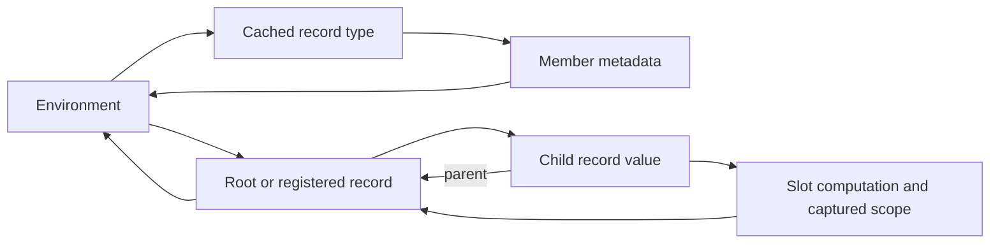

# Runtime cost and ownership diagnosis

Source baseline: `1a76e625` (2026-09-12). Sections 1–6 record the original
investigation and its private experiments. Sections 7–34 record subsequent
implementation steps; sections 35–37 record measurement-only follow-ups,
section 38 the first step they led to, section 39 a candidate that a
paired comparison did not support, and section 40 the first completed
largest-size run.
Observable behavior and the frozen specification are unchanged.
External models, profiles, and engine comparison reports remain
outside this repository, as required by [the measurement policy](DEVELOPMENT.md#performance-measurements).

For the latest implementation step, see
[map keys bound without a text value](#38-map-keys-bound-without-a-text-value-2026-09-19).
[Thin scalar payloads](#34-thin-scalar-payloads-experimental-2026-09-15) is the
representation step before it. The preceding
[progress checkpoint](#19-progress-checkpoint-2026-09-13) records the measurement
blocker and the larger-workload evidence still outstanding. The
[serializer discriminator](#35-serializer-discriminator-2026-09-19) follows up
the serialization regression measured with those payloads, and the
[locality discriminator](#36-serializer-locality-discriminator-2026-09-19)
identifies a mechanism sufficient to produce it. The
[serialization census](#37-serialization-census-2026-09-19) places the
evaluated output against that mechanism.

The current engine already shares Programs, retains eligible reference rounds,
and cuts off propagation when results are equal. The remaining costs include
work performed before those query bodies run and after their results are ready.
A count of executed queries therefore does not measure an entire operation.

## 1. Measure disjoint stages

Separate source loading/checking, input binding, evaluation, reference settlement,
retained-round transition, final validation, output conversion, file writing,
and object destruction. A settlement timer is inside evaluation; serialization
and typed JSON reading are inside emission. Subtract measured children from
their parent before adding stage contributions.

For a Session update, measure apply, preparation, evaluation/validation, and
serialization separately. A hot Run retains the previous Run's internal timing
record; use a timer around the public request. Full-recompute mode can evaluate
the old document while evaluating an edit expression and evaluate the updated
document again during run. State both boundaries when comparing it with reuse.

Keep repeated uninstrumented latency samples separate from diagnostic runs.
Peak RSS under compression/swap is not allocated bytes or logical heap size.
Neither a timeout nor an out-of-memory failure supplies a completion time.

## 2. Edit preparation revisits overlapping value subtrees

In [Edits.begin](../decl-ts/src/qengine/edits.ts), every invalid producer can
recursively collect the member keys below its previous value. The outer
`invalid` set avoids processing a query key twice, but each producer creates a
new descendant set and traverses its value before the queued keys are deduplicated.
Overlapping parent/child values can therefore be walked repeatedly.

The cost follows the sum of the traversed subtree sizes, not just the number
of invalid queries. A deeply nested value tree can make that sum quadratic.
Deduplicating the final key set does not remove the traversal that constructs it.

A private experiment used one object-identity visited set for the entire
invalidation walk. It preserved the prepared and executed query counts and
produced identical output, while substantially reducing repeated traversal.
This isolates redundant preparation from useful recomputation. It is not a
proof that the prototype covers every language case or improves peak memory.

For an implementation change, preserve the walk's read-only value boundary,
direct-input diffing, canonical paths, and frozen owners. Exercise shared values,
structural insertion/removal, absent members, references, diagnostic recovery,
and fresh-versus-retained evaluation. A visited set for each individual producer
would still repeat work across producers.

## 3. Aggregate observations have two independent problems

[Engine.equalValues](../decl-ts/src/engine.ts) observes records under both operands
before comparing them. Comparing an array containing records with `null` records
aggregate reads even though that comparison does not inspect record contents.
Operand evaluation and its ordinary dependencies remain necessary; those
content observations are a separate concern.

When any `value:` dependency exists, `Edits.begin` puts all saved values into
its preparation queue. That fallback applies even when the aggregate reader
belongs to an unrelated root. This is broader than following the dependencies
of the edited member.

The independently authored [aggregate diagnostic](../tests/benchmarks/README.md#aggregate-observation-diagnostic)
binds 5,000 three-member records,
edits one supplied integer, and exports a scalar sum. An additional output
compares an unrelated record with null or with itself. Two warmups precede five
measured edits in the TypeScript reference; every scalar result is checked.

| Additional observation | Prepared queries | Executed member queries per edit |
|---|---:|---:|
| Constant boolean control | 7 | 5 |
| Unrelated record compared with null | 15,009 | 5 |
| Unrelated record compared with itself | 15,009 | 5 |
| Null comparison with unnecessary aggregate observation omitted in a private experiment | 7 | 5 |

The null case can avoid an unnecessary observation. Genuine structural equality
still needs a dependency-scoped representation of the aggregate it observed.
Removing the null observation alone is insufficient for programs whose
record-producing roots or frozen-reference dependencies independently reach
most of the graph. Maintain reverse edges and narrow producer boundaries as
separate experiments; do not assume one change removes all preparation.

## 4. Rust ownership contains multiple strong-reference cycles

The Rust Engine already installs its evaluator hooks through weak references.
The unresolved ownership paths are elsewhere:

[Env.type_memo and Member.menv](../decl-rs/src/semantics.rs) form a cycle even
without a runtime record: `fill_record` stores a strong environment reference
on resolved member metadata. Runtime roots/registry, record environments,
parent links, and captured scopes add other paths.

A synthetic probe retains only weak references after dropping Session and Run.
It then removes individual ownership edges from the otherwise abandoned graph:

| Case | After Session/Run drop | Further cuts required in the probe |
|---|---|---|
| Scalar output, no resolved record type | Engine and environment released | None |
| Scalar output after resolving one named record type | Engine released; environment remains | Clearing the type memo releases it |
| One flat record output | Engine released; record and environment remain | Clear the type memo, then runtime roots/registry |
| A record containing one child | Engine released; both records and environment remain | The preceding cuts and parent cuts are insufficient; clearing slot computations releases the graph |

These destructive cuts run only after evaluation in a private ownership probe.
They diagnose the cycle; they are not a proposed production cleanup routine.
They establish retained ownership on these cases, not a byte count or a cause
for every capacity failure.

Define a strong owner for a universe/run and each frozen snapshot. Use weak
back-references or arena identities within that ownership boundary, including
captured scopes and type metadata. Changing only `parent` is insufficient.
Changing every reference to weak ownership without preserving the lifetime of
returned values, imported modules, and frozen snapshots would also be incorrect.
Auxiliary cache-size regressions do not prove that the surrounding object graph
is released; add explicit lifetime checks at the public-owner boundary.

TypeScript's tracing GC and Python's cyclic GC have different collection
behavior. For Python, distinguish evaluation-time collection from the cost of
reclaiming unreachable cycles after the command body returns. An explicit GC
diagnostic can locate that work; suppressing finalization is not a production fix.

## 5. Rust recompiles the numeric JSON regex per number

The recursive numeric branch of [read_json](../decl-rs/src/semantics.rs) calls
`Regex::new` for each token. The pattern is invariant. The plain emission path
serializes an engine value, reads the resulting JSON back into typed values,
and renders it, so the problem also applies to the completed output.

Caching the compiled expression removes repeated compilation while preserving
the pattern and capture rules. Compilation count changes from one per number
to one per process; parsing still requires work proportional to its input.
Python already uses a module-level compiled numeric expression.

Keep regex lifetime and direct output emission as separate changes. A direct
canonical JSON path must preserve integer/decimal distinctions, escapes, order,
newlines, diagnostics, and the other renderer modes. Use shared numeric JSON
cases and the existing parity gate, not only a large valid document.

## 6. Priorities and acceptance

1. Fix invariant regex compilation independently; verify exact output and
   numeric edge cases.
2. Correct Rust ownership at universe/run/snapshot boundaries; verify that
   inaccessible graphs are released, including types with no record instances.
3. Remove overlapping invalidation walks without changing the candidate set;
   then reduce aggregate and producer granularity with separate evidence.
4. Reduce old-value capture and per-instance slot/value metadata once allocation
   measurements identify their owners and required lifetimes. Shared Programs,
   Python `__slots__`, Rust shared paths/strings, and mimalloc already exist.
5. Consider scheduler identities and durability after measuring the remaining
   verification cost. A standalone query-database comparison does not include
   language binding, record construction, reference rounds, or full export.

The first three diagnoses have concrete code paths and isolated experimental
evidence. Broader representation changes remain design work. Each production
change needs relevant shared correctness cases and the repository's full
verification/parity gate. At diagnosis time, the private experiments had not
implemented those production changes; the completed follow-up is recorded below.

## 7. Implemented follow-up

The follow-up implements the invariant Rust numeric regex cache, a shared
object-identity visited set across each edit's invalidation walk, and
per-revision memoization of comparison snapshots. Immutable record paths are
formatted once per record in preparation rather than once per member. Each
snapshot is captured before any slot is mutated; its temporary index is released
after preparation.
The three implementations preserve their existing identity, path, slot-kind,
optional-presence, and frozen-owner comparisons.

Equality records aggregate content observations only for matching record,
array, or map operands. A null comparison and a reference/path comparison do
not observe container contents. Preparation resets the recorded aggregate
subtrees and follows their readers, instead of resetting every saved value.
An aggregate whose record is outside the current registry keeps the old
conservative fallback. Frozen/reference observations and broad expression
producers still require separate granularity work.

The Rust representation now tracks environments, records, and potentially
recursive types with weak handles. Its cycle collector enumerates owning Rc
edges, subtracts those internal references, and preserves every node reachable
from an unaccounted external owner. Shared containers, type members, captured
locals, module imports, and recursive types are separate identity nodes, so an
edge is counted once per actual owner rather than once per traversal path.
An uninspectable borrow or an opaque callback is treated conservatively through
external ownership; collection does not evaluate language expressions.

The last Engine and the outer CLI command trigger collection after releasing
their own fields. The public Rust `semantics::collect_cycles()` operation also
allows an API caller to reclaim cycles after releasing bare values or types
that outlived their Engine. Returned values and resolved types remain intact
while their caller owns them. This preserves existing strong-reference APIs;
it does not replace the complete runtime with an arena or weaken parent and
scope links. Opaque callback ownership may conservatively retain a graph.
Sweep time, transient memory, and live-engine collection frequency remain
performance considerations. Weak tracking handles also keep the Rc allocation
block reserved until the tracker prunes them, even if its value has already
been dropped. The current automatic boundary is the last Engine, not every
edit; long-lived sessions and concurrent owners require separate steady-state
allocation measurements and may benefit from cheap dead-handle pruning.

The Rust API driver verifies recursive type lifetime, abandoned scalar/flat/
nested/contextual runs, caller-retained values, an active borrow, and a Run
containing frozen reference snapshots. Shared `edits.json` cases verify bounded
preparation for unrelated null/self comparisons, nested and replaced record
comparisons, and aggregate observations combined with reference rounds. The
existing full verification and parity gate remains the behavior criterion.

The implementation passed `make verify` (1,277 identical parity judgments,
zero differences) and `make lint`. Performance evidence distinguishes complete
CLI process time from individual Session requests and from instrumented stages.
Fewer snapshot constructions do not alone establish faster preparation: pending
query entries and copied dependency sets remain separate costs. Similarly,
reclaiming abandoned runs does not reduce the live graph required by a single
large evaluation.

Full external-workload before/after measurements are recorded outside the
repository under the measurement policy above. The changes do not by themselves
establish faster initial evaluation in TypeScript/Python or increased capacity
for every large document. In particular, snapshot memoization and invalidation
walk changes target Session updates, while broad root producers and repeated
binding remain further optimization candidates.

## 8. Avoid unused Rust descriptor copies and slot capacity

`Engine::force_slot` now clones its optional `Compute` after cached, deferred,
and cycle returns. Its owned member/root names and supplied value are needed
only by actual computation. Owner routing, dependency recording, reference-round
value adaptation, absent-value acceptance, and diagnostic order stay in place.
The descriptor borrow ends before execution, so recursive evaluation can still
mutate slot state. Descriptor cloning and the transition to Forcing use one
mutable slot lookup; delaying a clone must not add another linear name scan on
the uncached path. TS/Python already retain a callable reference here; there is
no equivalent owned descriptor clone to remove in those implementations.

`Engine::bind_record` reserves the known member count in the new slot vector.
Each schema member contributes one slot, including absent and invalid members.
Rebinding still preserves the old vector for `Edits::bound`; reservation does
not reuse or overwrite that evidence. Exact capacity removes geometric vector
slack, but does not remove per-slot descriptors, names, values, or frozen copies.
Allocator rounding and the rest of the live graph prevent equating vector
capacity savings with an equal reduction in process RSS.

These two changes are separate performance interventions. The comparison uses
four frozen binaries (before, each individual change, combined), then a larger
before/combined confirmation. Output bytes and diagnostics must agree in every
accepted attempt; instrumented storage counters remain a separate series.

At this checkpoint, representation candidates included typed query identities,
shared schema member-to-ordinal lookup, immutable descriptor plans and compact
frozen slots. Rust record lookup scans its ordered slot vector; existing
Programs share member definitions but do not yet provide ordinal lookup. The
read sets and slot index still owned full string keys before the migration in
section 10. These are specific
gaps, even though shared paths, Programs and faster tables exist elsewhere.
Rust's public record and engine fields also impose an API compatibility boundary
on such migrations; CLI parity alone cannot prove source compatibility.

The next query-storage follow-up removed Rust's second dependency-set copy
during verification while retaining the preparation copy. Section 10 then
shares the preparation snapshot as well; neither step narrows invalidation.

The [comparison procedure](../tests/benchmarks/COMPARE.md) records hypotheses,
frozen artifacts, accepted/failed attempts and paired process observations.
Use small causal diagnostics before promoting a change to larger capacity tests;
do not rerun an unchanged full cross-language matrix for every host-specific
representation experiment.

## 9. Share temporary query storage

This intermediate step precedes the authoritative ID graph in section 10.
Its remaining String ownership and public-field compatibility describe that
checkpoint, not the later representation.

Rust's edit and reference-round preparation now builds reverse adjacency from
borrowed dependency and reader text. The temporary graph and its source borrow
end before revision preparation, freezing, or dependency replacement. The
invalidation queues and retained public maps still own strings. Previously,
`entry(dep.clone())` allocated a dependency string on every edge, even when the
map already held that key, and each reverse edge copied its reader string.
Borrowing removes these character-buffer allocations and shortens the reverse
graph's lifetime; it does not eliminate constructing or traversing the graph.

Rust's private Pending table now shares each snapshot through `Rc`. Recursive
verification keeps the pending marker until all former dependencies have been
checked, with owners before their contents. A verified cutoff then removes the
marker and moves the original dependency set back into the read table; a retained
alias uses the conservative clone fallback. Recomputed queries still replace
their read sets with newly recorded dependencies. A `Cell<bool>` preserves
forced invalidation while the snapshot is shared. This avoids the previous
second deep copy at compute entry, including queries already marked forced.
Preparation still takes the first snapshot and now allocates one Rc per Pending,
so reduced copying alone does not prove lower preparation time or peak RSS.

Occupied Rust read and revision-stamp entries update through borrowed keys.
The read-table owner or change-stamp key is copied only for a newly inserted
entry; incoming dependency strings and their set insertion are unchanged. Python's fixed-field
Pending dataclass uses slots; its dependency set and values keep their existing
ownership. TypeScript already references these objects and sets, so it has no
corresponding deep-copy or instance-dictionary intervention. These are internal
representation changes, not different language behavior or a migration of the
public Rust engine/record field types.

Validate initial, cached, equal-result, changed-result and restored requests.
Distinguish the number of independent wide aggregate queries from each query's
dependency degree. Every exported result and diagnostic stream must agree;
total-only checking can miss a broken secondary aggregate. Revision and slot
execution counters are cumulative within their retained owner: record per-request
deltas and verify that owner identity persists. Preparation counts describe the
latest edit, not a cumulative count. Graph scans and instrumentation run outside
primary request timers and in a separate diagnostic series.

Use each fresh process as a comparison replicate; repeated edits inside it are
nested observations, not independent process samples. Alternate before/after
order and retain all accepted observations. Report application, evaluation and
serialization boundaries as well as whole-process RSS/CPU separately. Fixed-field
object population measurements establish storage savings for that population;
they cannot be extrapolated directly to the entire Session or its process RSS.

## 10. Canonical query identities and shared read sets

Rust now uses one authoritative ID graph for Engine read owners, dependency
members, indexed slot keys, the computation stack, and private revision maps.
A query identity shares its text and caches its text hash. Equality first checks
identity and then exact text with the cached hash, so equal text from separate
pools remains equal. Ordering remains lexical. The ID hash encoding differs
from `str::hash`; the ID deliberately does not implement `Borrow<str>`. Textual
callers resolve through the pool, while internal callers that already own an
ID query the corresponding maps directly.

The pool holds exactly one canonical ID per spelling. A live graph,
computation, Pending entry, or frozen snapshot owns additional handles; an ID
has no reference back to an Engine, pool, or runtime value. Engines within one
evaluation lineage, including retained and fallback rounds, share the pool.
Older runs can legitimately keep identities alive, so pool counts can exceed
one Engine's current graph. An identity handle and cached hash add storage per
unique key while removing repeated owned character buffers. The balance depends
on key length, repetition, and dependency degree; canonicalization alone is
not evidence of lower total memory for every graph.

The interner uses a hash table with caller-supplied hashes. A normal lookup or
insertion hashes the text once and uses one table entry probe; growth and
shrink reuse the stored text hash. The earlier text-to-weak map hashed a fresh
spelling for lookup, cached-hash construction, and insertion. The new table
stores only the thin ID, reducing its element payload from 24 to 8 bytes on
64-bit targets without widening graph IDs. These payloads exclude buckets,
allocator metadata, and the key/text allocations, which still exist.

A pool-only entry is logically dead even though the table keeps its canonical
allocation. Lookup checks ownership before cloning and does not revive such
an entry; interning can reuse it without another allocation and counts that
revival toward maintenance. At a sweep threshold, the target is removed
before scanning and reinserted afterward so it does not inflate the prior
live-population count. Census and retention inspect borrowed handles, because
cloning for observation would create false liveness.

An empty `ReadSet` has no set allocation. A nonempty set shares its body through
`Rc`, and preparation clones that handle into Pending instead of copying every
dependency. Fresh computation replaces the owner's read-set handle at the
existing capture boundary. A writer uses copy-on-write if another snapshot
still holds the body. Verified cutoff moves the prior snapshot back after
recursive dependency checks. Equal recomputation retains the old change stamp
but keeps the newly recorded dependencies; equal values can have different
read sets. Partial reads on an ordinary error, absent versus retained-empty
owners, owner-first verification, and pending membership during verification
keep their previous semantics.

Revision methods now carry their entry identity through read lookup, slot
lookup, restoration, and change-stamp updates. For an eligible owner,
`begin_queries` changes from three logical pool calls to one, and `begin` from
four to one. A verified cutoff and successful equal-result recomputation each
change from three to one, excluding callbacks and recursive dependency work.
These are source-derived call counts, not measured hash probes or timings.
The default slot resolver can use the dependency ID directly; the custom
resolver retains its text boundary. Map hashing, reference-count updates,
invalidation walks, and query programs still cost work.

Actual member forcing also carries one identity through slot registration,
the computation stack, and revision computation. Previously each of these
boundaries interned the same textual key independently. The producer chain
now makes one interner call instead of two, or three when revision computation
is active. When a tracked parent reads an unforced slot, its recording helper
now returns the recorded identity for that same producer chain and retains
the already formatted slot key. This removes the second key formatting and
interner call on that eligible path. Verification-suppressed reads retain no
parent dependency; the producer still obtains its own identity at the existing
forcing boundary. Cached, deferred, cyclic, and frozen-owner paths keep their
original ordering and recording behavior. This does not remove the first key
allocation, change query granularity, or store an ID in every member slot.

### Cleanup at the correct lifetime boundary

Unconditionally scanning the full live query pool after every small scratch
expression makes a local request pay for the universe's pool size. The Rust
Session coalesces those scans until 1,024 identities have been created or
recreated since the last actual sweep. Live-key hits do not advance that count
or scan the pool. Missing or expired intern entries can trigger an automatic
sweep at a live-population-based size threshold.

A creation count alone is insufficient: a scan in the middle of a large
request resets the count while retaining that request's still-live identities.
An explicit flag remembers this in-flight sweep, forcing completion maintenance
after temporary slots, read sets, fallback roots, and change stamps are removed
or restored. Thus a large request's final cleanup does not depend on how many
additional identities it created after the last automatic scan. Ordinary
error results follow the same scratch cleanup path. This does not introduce
a general panic-unwind recovery contract.

Evaluation completion still explicitly sweeps after releasing its previous
round owner. Sweeping only removes entries whose sole owner is the pool
and shrinks substantially excess capacity. Small requests can leave dead text
until a later maintenance boundary; this is not a universal fixed-byte bound.
Old Run retention and value/type cycle collection have separate lifetimes.

### Scratch graph scans and prefix checks

Coalescing identity-pool maintenance alone left four whole-map passes in
`Session::scratch`: filtering the slot/read maps before an expression, then
cloning both key lists for removal afterward. It also cloned the registry to
obtain its length and formatted every instance path during cleanup. None of
that work depended on how many temporary entries a scalar expression created.

The Rust `under(path, root)` predicate previously constructed `root + "."`
and, when needed, `root + "["` for each non-equal path check. It now borrows the
suffix returned by `strip_prefix(root)` and accepts only an empty suffix or
one beginning with `.` or `[`. Equality, member descendants, and indexed
descendants keep their previous boundary rules; a merely similar prefix is
rejected. This allocation-free predicate reduced per-visit cost; by itself it
did not remove any full-map pass.

Scratch now uses a separate weak index of only underscore-eligible query IDs.
The pool appends an entry when it allocates a fresh eligible key, never on a live
hit or pool-only revival. Existing sweeps and subset enumeration prune expired
weak entries. Before evaluation, Session looks up those candidates in its own
maps to snapshot existing entries; keys held by old Engines in the same pool
need not belong to the current graph. Without a newly demanded fallback root,
post-evaluation cleanup visits only this subset. Temporary candidate handles
drop before completion maintenance, so enumeration cannot keep them alive at
that boundary. The index neither duplicates text nor changes QueryId's layout.

The slot predicate uses the raw path; read owners strip at most one `assert:`
prefix. Thus `assert:_.x` can be a removable read owner while a raw slot with the
same text remains outside the underscore slot predicate. `root:_` and `_other`
are excluded. Existing real underscore roots still require snapshot/restore.
A newly demanded fallback root retains complete graph scans and the original
key snapshots for its arbitrary name. Both branches remove all temporary read
owners before dropping any slot value, with the original per-key borrow scope:
destroying an instance can drop a public Bridge callback's user-provided capture.
Ordinary error cleanup preserves the same predicates and restoration boundary.

Registry length is read without cloning record handles. If no fallback root was
newly demanded, cleanup preserves the existing numeric prefix and tests only
the appended tail for a leading underscore name segment, without formatting
paths. Clamping the prefix to the current length preserves the old behavior
when a caller publicly replaces the registry. With demanded roots, all current
registry paths are still inspected, including publicly changed old instances.

Remaining whole-universe work must be measured separately: `Edits::prune` still
clones the current registry to build its live-address set and scans cached input
descriptions and roots. Existing pool budgets can still trigger a complete
identity sweep. A real underscore root or retained old Engine can also keep the
weak subset large. The common path is narrower, not universally constant-time.

These changes are separate from pool cleanup frequency. Unchanged
prepared/executed-query counts or unchanged graph population cannot establish
that the same preparation work took the same time. Compare scratch request
boundaries and allocation/profile evidence separately, with identical output
and diagnostics; retain the scan count and pool-maintenance policy in the
experiment description. Prefix-boundary correctness also includes empty and
non-ASCII roots, without imposing new assumptions about caller text.

### Assertion-free validation

Validation visits every registered instance, including records with no
assertions. Previously those empty visits still formatted an assertion key,
interned an identity, entered the computation stack, and built a scope and
diagnostic path. With a round cache, an empty visit retained no read owner, so
its new identity could immediately become a dead weak-pool entry. Final
validation runs after evaluation's completion sweep; such entries could also
make a later scratch request perform pool maintenance.

Rust now skips scope and stack construction for an empty assertion list.
Untracked validation returns immediately. Tracked validation preserves the
previous graph reset: with a round cache it removes an existing owner through
a lookup that does not intern a missing key; without a round cache it retains
an explicit empty read set. It leaves other owners and existing diagnostics
alone. The assertion list is read afresh because the public record type can
be mutated; nonempty assertions follow the original evaluation path.

This removes representation work, not language validation. Rust API tests
cover absent, empty, and populated prior owners in every tracking/cache mode,
plus assertion removal/restoration and ordinary-error dependency capture.
Lower dead-key counts are an expected storage consequence, not a change in
logical dependency edges. A complete-process comparison is still needed to
determine whether this bounded change resolves cold execution overhead.

### API and verification boundaries

The Rust `reads`, `slots_by_key`, and `computing` fields are now crate-private.
This is an explicit source API break. The
[migration guide](QUERY_GRAPH_MIGRATION.md) provides counts, sorted owned-text
exports, an ordered stack export, a live slot lookup, and a numeric storage
census. A second mutable String graph would preserve the storage and permit
uncoordinated writes; the implementation keeps a single authority. Public
record slots remain unchanged. TypeScript and Python retain their idiomatic
representations, and all three retain the same language and CLI contracts.

Use the shared equal-result dependency-switch case alongside error recovery,
owner removal/recreation, and reference-round cases. Rust-specific checks cover
cross-pool equality/hash consistency, snapshot copy-on-write, pool-only key churn,
owned API exports, and large temporary requests whose identities survive an
in-flight sweep. Private Rust checks also cover weak-subset boundary selection,
revival without duplicates, old-Engine membership, public registry/path mutation,
and tail cleanup that never borrows preexisting records. Their local success does
not replace the complete parity and
lint gate required for landing.

Measure request latency separately from storage census and graph export.
`query_storage` inspects the current state without pruning: pool counters cover
the lineage, while read-body and index counters cover the inspected Engine.
It deduplicates bodies present in that Engine's read map, not bodies retained
solely by Pending or other Engines. Usable capacity and struct/text payloads
exclude allocator overhead and must not be reported as RSS or whole-heap size.
The `scratch_index_*` fields report a separate raw weak Vec's entries, capacity
and weak-handle size; they do not count current read owners or retained text.

Canonical IDs, shared read sets, coalesced maintenance, ID propagation,
allocation-free prefix checks and narrowed scratch cleanup are separate
interventions. A combined before/after result measures the bundle;
an isolated variant or separate work/profile evidence is needed to attribute
an effect to one component. Keep each failed or superseded attempt, declare
its reason, and validate every fresh output before accepting any measurement.
External workload timings and capacity results remain outside the repository.
This section describes the mechanism and acceptance conditions; it does not
claim a new overall speedup or a completed final verification gate.

## 11. Compact output emission

A selected root's plain compact JSON output previously went through three
representations: `Engine::serialize` produced canonical text, `read_json`
allocated a raw document from that text, and the renderer serialized that
raw document again before adding a newline. This output work is separate from
the engine's binding, reference rounds, and final validation. Removing query
lookups alone does not remove the renderer's extra traversal and allocation.

Rust's non-template JSON emission now reuses the canonical text when the
resolved indentation is zero. It still serializes once at the same point and
adds exactly one trailing newline. The same rule applies to each fan-out item
after every destination path has been validated. Empty canonical text from
an unsupported public Value follows the existing decode failure path; an
actual empty-string document is valid JSON and uses the fast path. YAML,
indented output, and templates retain their format-specific processing.

This optimization covers selected-root emission, including `--output oid`.
The CLI's aggregate output without an explicit target has a separate document
assembly path. Report emission time separately from evaluation time and avoid
claiming that faster output fixes every internal evaluation cost. Use the
shared render/CLI/golden corpora and byte-for-byte parity, plus the Rust public
Emission invalid-value regression, to preserve output and failure behavior.

## 12. Streaming canonical serialization

Reusing canonical text in the renderer removes an output conversion, but the
engine must still construct that text. Previously each recursive serializer
returned a subtree String; containers collected those results in vectors,
joined their bodies, and allocated surrounding JSON text. Rust now appends
into one owned result String per serialization. Container checkpoints remove
the separator and key when a typed child has no document representation.
String and key escaping append directly; integers use their existing Display
implementation, while float and reference-path formatting retain their prior
helpers. Record entry-name membership borrows names under the existing record
borrow instead of cloning each String. The result buffer can still grow and
formatters still allocate; this is not an allocation-free traversal.

This change deliberately does not cache Session output. Rust callers can
mutate public record slots and extras, array items, map entries, and the
environment's base-unit metadata without advancing a Session revision. Raw
documents can also contain `PreVal` expressions whose evaluation reports
diagnostics or reads dependencies each time serialization runs. An identity
or revision keyed result cache could return stale bytes or suppress those
effects. A general result cache would need an explicit mutation/invalidation
contract, or a content check that itself traverses the value. Fresh traversal
preserves the current public contract.

The writer keeps document-entry order followed by eligible schema members,
the settable-only projection, and existing hidden/invalid/absent checks. Typed
unsupported values are omitted; raw unsupported values and failed raw PreVal
results become `null`. Top-level unsupported values still return empty text.
PreVal callbacks retain their left-to-right order and exactly-once execution
per visit, including continuation after an ordinary failure. The same immutable
RefCell borrow spans each record, array, or map traversal, and schema members
are still obtained after the record's document entries. Direct appending does
not introduce a new mutation or panic-recovery boundary.

The Rust public API regressions exercise mutation between serializations,
raw callback effects and dependency capture, projections, and directly
constructed numeric/string boundary values. A shared render case combines
explicit zero-indent selected-root output and no-template JSON fan-out, with
large integers, finite float extremes, control/Unicode escaping, quantities,
empty/null values, and hidden/optional omission. Existing shared expectations
remain unchanged; byte-for-byte parity and the complete gate are still required.

Measure serialization churn and latency separately from evaluation and from
the earlier compact-emission conversion removal. Requested allocation bytes
and allocation-call counts describe churn; they are not latency shares, RSS,
or allocator-resident memory. Record the live allocation population before
serialization and its additional peak. Eliminating intermediate output buffers
does not release the already retained records, slot descriptors, values, and
query graph that form the evaluation working set. Those owners remain a
separate investigation, and an overall improvement must be established by
validated end-to-end measurements. Host-specific results remain external.

## 13. Measuring temporary-query cleanup

Count scratch administration separately from expression evaluation. Before the
subset change, the two pre-expression filters visited every slot/read entry;
the two post-expression map traversals cloned every key. The subsequent removal
loops checked those cloned keys again. A report that adds pre-map visits to
post-map clones describes those counted map operations; it must not imply that
the later vector-prefix tests were also independently counted.

For the narrowed implementation, distinguish weak-index pruning/upgrade visits,
current-map lookup candidates, actual underscore snapshots, newly demanded
roots, appended registry entries, and full fallback-root scans. The raw weak
index may include pool-only IDs and IDs held by old Engines; its size is not the
number of current graph owners. A zero-demand request with an empty underscore
subset should do no full slot/read scan or preexisting-registry path formatting.
This expectation describes the cleanup branch, not all work performed by the
request.

Keep `Edits::prune` and identity maintenance visible. Edits pruning still clones
the current registry, builds its live-address set, and scans cached input and
root descriptions. Pool maintenance can scan all retained identities when its
existing budget or in-flight-sweep flag requires it. Root-name snapshots and
diagnostic truncation are additional administration. Public registry/root
mutation prevents assuming that old cached descriptions remain valid merely
because a temporary expression created no new root.

Allocation tags should separate these administrative costs from nested
expression work. Report allocation/reallocation calls, gross requested bytes,
live-byte change and peak separately: a high gross-byte share is not a latency
share, and allocator requested bytes do not measure physical RSS. Collect work
and allocation counters in a separately instrumented diagnostic build, then use
the uninstrumented release binary for the fixed before/after timing schedule.
Every diagnostic and primary output must match an independent exact oracle;
unchanged graph populations alone cannot prove identical cleanup work.

## 14. Retained snapshot slot capacity

Current record construction reserves its known member count, but copied records
in `RoundCache::copy` grow their slot vectors from an empty vector.
The copied slots have no computation descriptor, yet each vector element still
contains the complete inline Slot representation. Geometric growth therefore
could retain unused, full-sized slot positions in successful snapshots. A
count of live records or query IDs alone misses this capacity cost. The inline
region occupied by `compute: None` overlaps the slot payload; it is not another
heap allocation and must not be added to that payload as potential savings.

A Rust candidate reserved `b.slots.len()` in the local copy buffer. The same loop checks
slot state, copies each value and preserves member order. The placeholder enters
the copy map before recursion, and the completed vector is assigned at the same
point as before. Capture ownership, descriptor layout, fallback behavior and
public APIs were unchanged. This was a Rust representation experiment; the
three implementations retained the same observable behavior.

The candidate reduced the targeted retained capacity and passed correctness
checks, but repeated large latency and CPU increases in individual confirmation
pairs failed its declared performance screen. Other pairs improved; this does
not establish a consistent slowdown or its cause. The candidate was withdrawn
and the runtime keeps the original copy buffer. Preserve the positive memory
evidence and adverse timing observations together, and resolve measurement
variability before promoting the change. Host-specific results remain external.

Upfront reservation can allocate more before a copy fails, and can overlap
recursive child allocations earlier. A successful final retained-byte reduction
does not prove a lower transient peak for every failed or deeply recursive
freeze. Keep existing reference-round, cyclic, fallback and Session coverage,
and measure requested peaks alongside retained bytes on the accepted workload.

### Establishing the retained cause

Inspect a quiescent diagnostic Engine after validating its complete output and
releasing the output buffer. Deduplicate reachable Rc bodies by pointer and
type, including current and snapshot Engines, their captures and materialized
values. Report direct registry/snapshot membership separately from transitive
root reachability: a shared environment can lead back into another Engine,
so reachability masks do not establish exclusive ownership. Neither category
alone proves which constructor allocated a body.

Compare vector length, capacity and element layout within those categories.
An isolated before/after change should preserve initialized slots, owner and
query populations while eliminating the targeted unused capacity. Corroborate
the capacity difference against allocator-requested live bytes at matching
phase boundaries. Account separately for probe startup offsets, traversal
metadata and the compact diagnostic report retained after traversal. Gross
requested/freed bytes and reallocations explain allocation work; they are not
elapsed-time shares or physical RSS.

A census must declare its coverage. Opaque callbacks, AST bodies, external
callers, unreachable cycles, allocator metadata and unmeasured numeric storage
prevent treating the covered graph as an exhaustive heap census. Budget or
borrow failures make it incomplete. Preserve partial attempts and prospective
budget revisions instead of pooling their populations with completed runs.
Per-type visited tables and batched root traversal can reduce diagnostic
metadata without changing production data structures; verify their partitions
and small-graph equivalence before reusing that diagnostic version.

### Repeating the experiment

Freeze source, compiler, dependency, allocator, helper and executable bindings
before each series. Use a complete small-case census to choose one intervention
and to estimate diagnostic overhead before increasing workload size. Compare
baseline and candidate with the same diagnostic implementation and coverage
budget. Run uninstrumented alternating CLI pairs separately, validate every
full output, and preserve warmups, individual samples, adverse results and
the known-competitor guard log. Session initial, unchanged, equal-edit,
changed-edit and restore requests need their own output and work comparison;
a single Session process per variant establishes equivalence, not a reliable
speedup. Keep the complete parity, lint and unchanged-format gates tied to
the final source. Host-specific results and attempt receipts remain external.

The next capacity candidate is array construction whose output length is
already known after flattening or binding. Verify each constructor's successful
length and early-return semantics before reserving. Broader changes to captured
scopes, descriptor sharing or retained materialization need separate lifetime
and mutation evidence; capacity slack does not establish that a live captured
value can be released.

## 15. Timing variation and complete command teardown

Before interpreting a small candidate timing difference, run a fixed same-binary
control through the same comparison harness. Freeze the executable hash, equal
label shapes, alternating order, output oracle, observer cadence, and continuation
criteria before collecting new results. Preserve warmups and every measured pair.
A nonquiet control prevents promoting a candidate from that campaign; it does not
identify the cause of earlier adverse pairs. A quiet control permits a bounded
comparison but proves neither equivalence nor absence of observer overhead.

Record terminal child user/system CPU and resource counters separately from
sampled live process and host counters. Bind live samples to PID, parent and
kernel start identity. Verify native field layouts and CPU units with an owned
small process before interpreting model observations. Clock names alone do not
establish a shared epoch: use explicit matching clock domains when joining
in-process phase boundaries to an external sampler. Keep sampling windows,
interior gaps and observer CPU cost visible. Machine-wide compression and swap
changes are associations, not memory traffic attributable to the measured child.
A sampled RSS maximum is a lower bound on the process peak, and physical footprint
is a different measure from retained requested allocation bytes.

The complete selected-file CLI lifecycle includes output-buffer release,
runtime-owner release and final command cleanup. `cli::evaluate` writes and
consumes the output body while the Engine and modules remain alive. Releasing the
last Engine can invoke cycle collection; the `CommandGuard` in `cli::main` also
collects after command locals have been released. A helper that ends at emission
omits this work. Measure evaluation, validation, emission, file writing, buffer
release, runtime-owner release and final command sweep as separate contiguous
wall/CPU intervals. Let only scalar facts escape the runtime-owner scope before
measuring the final sweep. Do not add a graph census to that timing interval.

Such a helper provides supporting attribution. Dispatch, binary layout, output
wrappers, instrumentation and process-exit boundaries still differ from the
production CLI. Do not substitute helper totals for native CLI timings or compare
teardown-inclusive totals with an earlier teardown-excluding helper as a speedup.
The collector's returned visited-garbage-node count describes its existing work;
it is neither freed bytes nor an exhaustive allocation count.

Keep repeated analysis economical: reuse immutable build/oracle receipts, build
only the diagnostic variant required by the prospective decision, and validate
each fresh full output once. Subsequent audits can authenticate the small receipt
and check the retained file length instead of rereading every large output.
Separate experiment decisions, primary observations, supporting phases and
source hypotheses. Preserve failed instrumentation assumptions and withdrawn
candidates so the next iteration begins from established evidence.

The completed control found large differences between identical-binary runs, so
its declared decision kept the capacity candidate withdrawn. The separately
measured baseline phases identify evaluation and runtime-owner release as the
main remaining costs; the owner-release interval combines ordinary destruction
with automatic collection. Split collector calls and passes before attributing
that entire interval to GC or changing when a sweep runs. Queue deduplication
and flatter adjacency storage are bounded representation candidates, subject to
preserving edge multiplicity, external-owner accounting and conservative borrow
or opaque-callback handling. Per-phase host telemetry cannot resolve intervals
shorter than its sampling cadence. Exact results and host-specific timings remain
in the external campaign report.

## 16. Separating evaluation, allocation and collector work

The next diagnostic separates each evaluation round into binding, initial forcing,
reference settling, edit completion, edge comparison and snapshot advance. Settling
has its own nested intervals for deferred forcing, deferred-root binding, final
forcing and edge comparison. These intervals explain the parent round; adding them
again to the round or command total would double-count work. Snapshot advance must
remain visible even when the following round reuses most computed values.

Collector calls are classified by their actual trigger. Each pass partitions seed,
trace, root classification, marking, clearing and scratch/Graph destruction. The
last interval includes the existing queue, live bitmap and Graph drop order, not
just deallocation of the Graph header. Calls nested inside runtime-owner release
can be subtracted from that interval to expose time outside collector call clocks.
That residual includes ordinary destruction and small boundary overhead; it is not
a separately sampled pure-destructor timer. A helper's final public collection has
an explicit trigger even though it occupies the native CLI's command-sweep boundary.

The bounded first workload confirms that duplicate mark-queue pops are numerous,
but tracing takes much more collector time than marking. Flat adjacency removes
many per-node vector allocations while preserving edge occurrences and node order.
Its first diagnostic preserves the graph populations and exact output, but does
not establish an end-to-end speedup or a smaller whole-process requested peak:
the peak can occur during evaluation, before collector scratch is allocated.
Keep allocation-call reduction, collector latency and command latency as separate
results. Lifetime tests and a declared adoption criterion are required; memory
acceptance does not establish native latency acceptance.

Array counters distinguish typed binding, literal materialization and snapshot
copying. Record successful length/capacity, known expected length, failed attempts
and construction traffic at each site. Summed unused tails are a traffic measure;
shared arrays and superseded snapshots prevent interpreting that sum as uniquely
retained bytes. Known-length reservation can remove growth reallocations, but an
early failed copy may allocate its full reservation before returning. Validate both
successful output and failure/Session behavior before promotion.

Materialization counters distinguish hits, misses, failed attempts, insertions and
cache suspension/restoration. The baseline cache owns both a raw literal handle and
its result. A typed weak raw handle can pin the allocation identity without keeping
the raw body and captures alive; the result remains strongly owned. This addresses
ownership duration, not cache lookup count. Test repeated materialization, callback
evaluation, failed retries, raw-address reuse, public copy-on-write and returned
closures. Earlier destruction of deep raw/capture chains is an additional stack
and lifetime boundary. A high miss count alone does not prove safe reclamation or
exclusive ownership of every reachable capture.

Smaller slots and prefix-sharing paths need equally explicit accounting. Moving a
Compute descriptor behind Rc reduces unused inline slot space while introducing
descriptor allocations and traced graph nodes. Trace each shared descriptor's
captures once, preserve binding-time metadata and expose copy-on-write access for
public mutation. A strong collector-owned descriptor can also delay an opaque
capture's destructor until Graph destruction, changing its observations of other
unreachable owners. The corrected experimental collector node holds a Weak and
counts no graph-owned strong reference for that kind. It upgrades only while
tracing; externally retained descriptors still root their captures. Test both
external liveness and destruction timing instead of treating either as sufficient
proof of the other. More descriptor nodes still increase tracing and root scans;
flat adjacency removes per-node allocation overhead, not that additional work.

Prefix paths must count outer handles, strong and weak-only nodes,
pool metadata and explicit flattening. A stored flat cache can duplicate the very
segment buffers the change intends to remove. Neither layout arithmetic nor a
combined path census establishes the savings of a selected array/map-only change.
Compare the requested global peak separately from live bytes after emission: a
candidate can move its peak to an earlier evaluation interval. Account for the
bounded weak pool and temporary exports, and verify that path counters and their
thread-local storage are absent from the feature-empty production build.

The campaign first measures these candidates independently. Immutable source copies,
failed-build receipts, a small allocation-ledger self-test, exact output receipts
and scalar interval validators make subsequent comparisons reproducible without a
full heap census on every run. The current host remains the authorized execution
environment; bounded supporting diagnostics can proceed while primary timing
quietness remains unresolved. A prospective memory adoption decision may require a
minimum incremental reduction over a simpler combined candidate, complete output
and allocation validation, explained collector work, lifetime/API tests, and the
final parity/lint/format gates. Keep the unresolved native timing question explicit
when using that decision. Isolated memory savings must not be added to predict the
combined result.

The retained implementation combines exact array and snapshot-slot reservations,
weak raw cache identities, shared Compute descriptors, flat collector adjacency
and prefix-sharing array/map paths. Its Rust ownership and source API changes are
documented in the [runtime memory migration guide](RUNTIME_MEMORY_MIGRATION.md).
Sharing descriptors increases the number of traced nodes even when flat adjacency
removes most tracing allocations. Compare the total command, each collector phase,
and the final live-owner counts before proposing another collector change. A lower
whole-process peak can coexist with a larger collector scratch peak or a longer
final sweep. Single instrumented observations identify work to investigate, not a
reliable speedup or regression percentage.

On macOS, distinguish raw `HOST_VM_INFO64` counters from the columns displayed by
`vm_stat`: raw `free_count` already includes `speculative_count`. Adding them
double-counts speculative pages. Neither that free queue nor a reported memory
free percentage establishes how many bytes a new workload can use without paging.
A cache-heavy machine can have few free pages while reporting normal memory
pressure. Record the kernel pressure status, allocation footprint and paging
traffic together. A monitored footprint limit and owned-process cleanup bound a
supporting experiment only approximately; sampling and termination can overshoot.
Changing a resource-readiness policy requires a new prospective decision, with the
old rejected attempt preserved. It cannot turn missing native samples into an
accepted timing comparison.

## 17. Initial Session attribution and repeated build cost

The accepted three-pair native Session measurements showed an initial Full-run
increase of 113.589 ms on average. The existing inner timer accounts for
113.659 ms of that change; the outer-minus-inner residual changes by -0.070 ms.
That residual includes retained-run preparation and entry/return work, so it does
not implicate document-key serialization as the source of the increase.

A separate fixed diagnostic pair runs only the initial OAD50 Session request,
final then baseline, with matching optional hooks and a counting allocator. Both
processes complete under the same monitored resource contract. Their compact OID
outputs are byte-identical to the independent Session oracle (20,658,167 bytes),
and each performs 1,459,137 slot computations. These single observations explain
instrumented work; they are not pooled with native timings or treated as a
statistically confirmed regression.

| Interval | Baseline wall ms | Final wall ms | Change ms |
| --- | ---: | ---: | ---: |
| Initial Full request | 6389.164 | 6532.209 | +143.045 |
| Fresh-run checking | 100.144 | 102.409 | +2.265 |
| Fresh-run evaluation | 6246.160 | 6386.979 | +140.819 |
| Fresh-run validation | 40.592 | 40.793 | +0.201 |
| Retained-run preparation after fresh return | 1.877 | 1.630 | -0.247 |

The Full row contains the later rows; it must not be added to them. Within
evaluation, first-round deferred-slot forcing adds 131.090 ms, and deferred-root
binding adds 76.162 ms and 40.178 ms in the two rounds. Snapshot advance saves
89.150 ms. These competing costs explain why fewer allocations and a smaller
retained graph do not guarantee a faster initial request. Full requested-live
bytes at its end fall from 3049.858 MiB to 1942.364 MiB; the process-global
requested peak observed there falls from 3055.529 MiB to 2027.624 MiB. Neither is
RSS, and the global peak is not a phase-local peak.

Both automatic collector calls within the Full request occur during checking,
totaling approximately 0.325 ms. No collection overlaps evaluation. Final Session
release is a separate interval: 1344.276 ms becomes 754.663 ms, including collector
time of 516.895 ms and 455.099 ms respectively. Teardown cannot explain an initial
request timer that excludes it. Investigate deferred forcing and binding next;
the current observations do not distinguish Compute allocation, prefix-pool work,
materialization, ordinary reference release or memory locality within those phases.

The optional [`session-initial` example](../decl-rs/examples/session_initial.rs)
and the [migration guide](RUNTIME_MEMORY_MIGRATION.md#initial-session-attribution)
make these boundaries reusable. Scalar Session spans are nested around the existing
Engine spans; all hooks are absent from feature-empty builds. The archived campaign
under `../decl-analysis/2026-09-13/runtime-reduction/session-initial-attribution/`
contains the fixed protocol, source/build bindings, exact-output validators and
phase/GC analysis. Missing original-baseline100 and final200 evidence remains
separate; this OAD50 diagnostic does not close either requirement.

Repeated verification also exposed unnecessary native recompilation: the
TypeScript build deleted and recopied identical Rust/Python grammar sources.
Content-aware synchronization now preserves unchanged file modification times
while still copying changed/missing files and removing stale entries. Explicit
header dependencies preserve rebuilds on header edits, additions and removals;
previously the unconditional C-file rewrite masked that dependency gap. This is a
build-workflow improvement, not a change to Decl evaluation speed. Check actual
Cargo freshness and the native output files' bytes/mtimes in addition to the small
filesystem and header-dependency checks when assessing its effect.

## 18. Deferred path construction: candidate and native control limits

The follow-up to initial Session attribution isolates a bounded weak ancestry
cursor for retained container paths. `PrefixPathPool::retain` previously hashed
all segments on every call, including already shared ancestors. The candidate
keeps one weak tail and its depth, compares at most 16 borrowed ancestors, and
starts the ordinary pool lookup at the unmatched suffix. Empty/deep paths reset
the cursor; expired weak tails use the existing lookup path. Every call still
returns a new outer `Rc`, and the cursor owns no runtime value or strong path node.
The weak cursor can reserve one additional dead node allocation; its diagnostic
counts are separate from the bounded hash table and are not unique-byte totals.

Matched optional phase endpoints now copy cumulative prefix and constructor/cache
counters without allocating or walking a graph. Compare these counts at equal
path inputs, public query work and complete outputs to identify the operations
removed. Constructor traffic is not a census of live owners; gross requested
allocation bytes are not RSS or footprint. A global requested peak is not a
phase-local peak.

Instrumentation matters: skipping a lookup also skips its diagnostic counter
update. Equal counter schemas do not guarantee equal instrumentation cost.
Changes in a stage that performs no prefix work cannot be assigned directly to
lookup removal. Keep diagnostic timing separate from feature-empty native results,
and leave host variation, ordinary reference release and indirect memory effects
unresolved unless a separate experiment distinguishes them.

The next candidate additionally removes intermediate `String` allocations at 12
Engine path-segment construction sites. Borrowed names/keys are copied directly
into a fresh `Rc<str>`; this preserves segment ownership, canonical Name/Key kinds,
callback boundaries and descriptor lifetimes. Its diagnostic comparison observes
less allocation traffic at equal public work. Small differences in weak-pool
history mean the net allocator change is not an exact temporary-String census.

Native experiments first run discarded warmups and same-binary A/A control pairs,
then independent initial A/B pairs, followed by descriptive five-request Session
and CLI pairs. The initial helper preserves the existing `Session.run(Full)` wall
interval and adds a process-CPU envelope immediately outside it. Whole-process
time, including ordinary teardown, is recorded separately. Freeze the source,
actual build features/artifacts, output oracle, schedule, resource/observer limits
and adoption criteria before execution. Validate each fresh complete output once;
subsequent reviews can use the bound small receipts. Run builds, tests and model
measurements sequentially.

The cursor-only campaign passes execution and A/A control, but misses its fixed
native improvement screen despite consistently favorable pair directions. The
combined candidate's separate campaign fails A/A control, so its A/B and supporting
cells are not launched. Neither warmups, earlier samples nor diagnostic timings
can supply that missing comparison. These engineering screens are not significance
tests or proof of equivalence.

The implementation in this working tree is a reviewable, uncommitted candidate;
performance adoption remains pending. Do not change the threshold after observing
results or retry the consumed schedule until it passes. A justified future
measurement must declare its conditions and decision rules before execution.
Original-baseline100 and final200 evidence remains separately incomplete.

In accordance with the [measurement policy](DEVELOPMENT.md#performance-measurements),
the detailed external-model results, schedules, failures, source/build/oracle
bindings and supporting analyses remain under
`../decl-analysis/2026-09-13/runtime-reduction/deferred-cost/` (`report.md`).
The two native campaigns are `measurement/` and `measurement-c/`; the latter
explicitly maps its analytical B label to the combined source candidate C.

A subsequent follow-up (`measurement-c-settled/`) addresses a concrete gap in
competitor detection: a known workload classifier can miss unrelated Node test
runners and their individual test-file workers. Extend the predicate on the
existing cached process table, preserving owned-descendant exclusions and exact
supervisor identity checks. Test both recognition and ordinary editor/LSP cases;
do not exclude every Node process or infer past interference from newly observed
work. Apply the same predicate before and during each measured child.

That follow-up adds one fixed prelude after external test work ends, with all
observation offsets and rejection rules declared in advance. A bounded scheduling
deadline is not a hard timeout on an inherited process-table call; reject late
observations even when they report no competitors. Fixed snapshots establish
only what was observed at those times. The strengthened guard and prelude pass,
but the same-binary Full control still rejects the campaign, leaving candidate
adoption pending. Whole-process percentages use a different denominator and must
not substitute for the failed Full-specific control. Preserve the outcome and
improve the next measurement design before launching another comparison.

The subsequent interleaved design (`measurement-c-interleaved/`) places controls
early, in the middle and late. A timing-only control miss sets an irreversible
adoption veto while the remaining fixed comparisons continue; hard integrity,
resource and observer-cost failures still stop the queue. Report complete valid
data separately from passing all adoption requirements. Opposite-order blocks
can describe sensitivity to ordering, but must not replace the declared raw
paired statistic or remove a failed control.

External work can start after launch checks pass. An interrupted comparison
therefore retains its successful unpaired observation and marks the remaining
specs unexecuted; it must not borrow a counterpart from an older run. Missing
late controls and supporting measurements are incomplete evidence, not observed
regressions. Coordinate a non-overlapping host-use window before a separately
declared future measurement; a classifier cannot reserve the host against
another session starting work.

The coordinated follow-up (`measurement-c-coordinated/`) keeps the execution
code, order and thresholds unchanged after the user-specified pause. Its fixed
prelude passes, but the first warmup encounters non-NORMAL kernel memory pressure
and stops before any complete output or treatment pair. Preserve this resource
failure separately from the preceding competitor interruption. A completed pause
and absence of classified work do not establish enough host memory capacity.

Inspect prelaunch and during-child host observations separately: compression
already increasing before the child starts limits attribution to the candidate.
Sampled process footprint is neither the terminal peak nor all host memory.
Post-stop process RSS can describe later residents, but excludes compressed
footprint and cannot identify the owner of earlier pressure. Reclaiming host
capacity is an external-state change; changing timing or pressure thresholds to
make this consumed campaign pass is not validation.

## 19. Progress checkpoint (2026-09-13)

This checkpoint precedes the implementation follow-up in section 20.

The combined Rust candidate C is implemented and reviewable, but remains
uncommitted and is not adopted on performance grounds. It combines the bounded
weak prefix cursor with direct `Rc<str>` construction described in section 18.
Its native benefit is still unconfirmed. The latest resource interruption does
not establish a speed or memory regression.

| Work | Current status | Evidence still needed |
|---|---|---|
| Prefix cursor, direct string construction and diagnostic API guidance | Implemented; candidate retained for review | A valid native comparison before performance adoption |
| Language behavior and repository quality | Earlier verify, lint and unchanged-format gates passed; measured runtime sources and tests remain unchanged | Check the final source binding and run applicable gates before a commit; documentation updates are not a new full gate run |
| Measurement procedure | Fixed interleaved controls, exact output checks, resource stops and receipt-based review implemented | A complete campaign under eligible host conditions |
| Current native comparison | Incomplete; the latest campaign stopped during its first warmup on host memory pressure | New complete controls, treatment pairs and Session/CLI supports; preserve earlier partial and failed campaigns separately |
| Larger-workload validation and overall comparison | Incomplete | Original-baseline comparison, capacity and complete-output evidence, followed by an updated three-language/toolkit-engine/Salsa report outside this repository |

### Next actions and dependencies

1. **Proceed with independent source analysis.** Separate deferred binding,
   deferred forcing and snapshot advance. Identify the work attributable to
   allocation, ordinary reference release, `Compute` creation and locality.
   Define one narrow intervention and the observations needed to distinguish
   its effect before changing the runtime. This work does not require a large
   model run or additional host memory.
2. **Restore measurement capacity on the current host.** Reduce unneeded
   application/VM memory occupancy and confirm the host state. A pause and an
   empty classified-competitor list do not establish sufficient memory capacity.
   No particular application's responsibility for the earlier pressure has
   been established.
3. **Complete a fresh candidate comparison once capacity changes.** Preserve
   the existing schedule, timing boundaries, output contract and decision rules.
   Keep every campaign separate; missing partners cannot be supplied from old
   observations. Use Full wall/CPU, memory and the supporting requests together
   to decide whether C meets the declared adoption requirements.
4. **Resolve the candidate and finish broader validation.** Review which
   changes to retain, revise or remove using the evidence. Complete larger-case
   baseline/capacity/output checks and update the external comparison report.
   Validate the final source and documentation before committing an accepted
   change. Neither performance adoption nor a commit is completed by this
   progress checkpoint.

The detailed dated handoff is
`../decl-analysis/2026-09-13/runtime-reduction/deferred-cost/progress-2026-09-13.md`.
It links the immutable campaign reports and records the remaining model sizes,
counts and decision criteria. This checkpoint changes documentation only;
it does not launch another benchmark or change the language specification.

## 20. Lazy diagnostic paths (2026-09-13)

The next source analysis separates deferred-slot forcing, deferred-root binding
and snapshot advance. Their costs have different causes: deferred forcing
constructs expression values and local frames, deferred binding exports paths
and creates bound containers, and advance builds graph indices and copies a
snapshot. Snapshot copying does not itself construct new `Compute` descriptors.
Existing aggregate counters do not separate ordinary release from copying time
or establish a memory-locality cause.

One redundant operation is explicit in Rust `Engine::force_slot`: before a
deferred/cyclic check or actual computation, it copied the instance path into a
vector and appended an owned member-name segment. Only cycle and evaluation-error
diagnostics used that vector. Successful forces and phase-one deferrals paid for
it too, while `run_compute` independently built the path needed for binding.
TypeScript and Python already construct these diagnostic paths in error branches.

Candidate D adds one change to the preserved candidate C: retain the existing
record-path `Rc` at force entry and format borrowed segments plus the member only
when an error is reported. The path snapshot must precede revision verification,
because a dependency resolver can call native code before the producer runs.
Replacing it with a lookup after failure would report the wrong path if that
callback changed the instance. No `RefCell` borrow crosses a callback, and the
temporary handle is released on return. The canonical path formatter is retained;
query-key text is not interchangeable with diagnostic paths.

The new capture changes temporary `Rc` ownership visible to native callbacks.
In particular, unique-access checks can now fail during dependency verification.
The [migration guidance](RUNTIME_MEMORY_MIGRATION.md#temporary-record-path-capture-during-forcing)
documents that boundary, copy-on-write and the caller's existing invalidation
responsibilities. The language, CLI and public field types are unchanged.

Small Rust API tests cover canonical cycle paths, non-dot-spellable member names,
Bridge callbacks that replace or mutate a path on success/defer/error, a revision
resolver that fails before the producer executes, and release of old path owners.
A separate fixed synthetic comparison uses the same small Check, Bridge, cached
and Deferred cases in C and D with the existing counting allocator. It confirms
less temporary allocation traffic at equal outputs and exposed work, with no
change in cached-read allocation or measured net-live growth. These observations
do not establish whole-process peak memory, native latency or large-model benefit.

This step leaves C's native adoption decision and larger-workload validation open.
C's archived source and binaries remain separate from D; neither interrupted
campaign is resumed or pooled. Further independent candidates include avoiding
redundant deferred-binding path exports, shortening advance scratch lifetimes,
reusing its registry snapshot, and allocating rebase result containers only when
they change. The existing rebase counter counts changed arrays, so it cannot
quantify all temporary containers discarded after an unchanged comparison.

Source analysis, the fixed small-probe plan, isolated C/D source/build bindings,
allocation results and verification receipts are recorded under
`../decl-analysis/2026-09-13/runtime-reduction/deferred-cost/lazy-diagnostic-path/`.
The final report distinguishes newly executed focused checks from the earlier
full repository gate; no native performance adoption or commit is implied.

## 21. Structural comparison paths (2026-09-13)

Tracing deferred-root binding found an allocation boundary in `value_eq`, not a
reason to skip rebinding. Rust acquired both operand places before deciding
whether either value was a reference. `Value::place()` exports an owned flat path:
arrays and maps flatten their retained prefixes, and records/references clone
their flat paths. Structural comparisons and container-versus-null checks never
use those paths. TypeScript and Python use the same broad comparison structure,
but their place helpers return existing path arrays/lists without making copies.

Candidate E adds one conditional to D: acquire places only when at least one
operand is `Ref`. The existing `cmp_path` and all structural branches remain
unchanged. In particular, reference equality can compare Name and Key segments
with the same text as equal; substituting `PrefixPath::PartialEq` would change
that rule. No binding, query observation, restatement check or reference
construction is skipped, and no cache, public field or API signature is added.
The explicit public `Value::place()` export remains available.

The external OAD model supplies a concrete route: its `Json` union starts with
null, so testing an already-bound array/map against that literal arm reaches
`kind_matches -> value_eq(container, null)`. The projection also filters values
against null. This source route explains how unused exports can occur during
deferred-root binding. The prior stage counters do not identify each export's
call site, so they do not establish that all 589,070 exports across two rounds
are removable or supply a native timing improvement.

The fixed small comparison separates direct equality from actual null-first
union binding. It includes empty, five-segment and seventeen-segment paths,
nested array/map contents, mismatches and unchanged reference controls. Full
result vectors and bound output contents are checked; retained output paths
remain distinct and are released after their owners are dropped. Allocation
traffic, net-live growth and retained path counts are separate measurements.

The 37 small cases contain 9,472 comparisons/binds per arm. All complete semantic
results and covered work agree. The measured intervals remove 18,944 explicit
prefix exports, 12,800 allocation/free calls and 3,305,472 gross requested/freed
bytes; reallocations and net-live growth are unchanged. Empty-path exports
require no backing allocation, so removed exports and removed allocations differ.
At depth 5, 256 null-first array binds reduce allocation calls from 1,799 to
1,543, and map binds from 4,103 to 3,847. Each binding case requests 30,720 fewer
bytes while retaining the same output paths. All seven reference controls and
the scalar control are unchanged. These are synthetic operation counts, not
whole-workload speed or peak-memory improvements.

A fresh full `make verify` passes for E: 1,278 identical CLI parity comparisons
and zero differences, alongside all three implementation suites. The experiment
report records diagnostic-feature tests and final lint/format evidence separately.

The source analysis, model-source identity, prospective plan, isolated D/E
builds, raw small results and validation receipts are kept in
`../decl-analysis/2026-09-13/runtime-reduction/deferred-cost/structural-equality-paths/`.
Native adoption and the outstanding large-model comparisons remain separate.

## 22. Local child binding paths (2026-09-13)

Candidate F adds a function-local path buffer to E's Rust array/map binding.
Previously, every accepted child copied the parent flat path and then appended
its index or key. A nonempty path copy had no spare slot, so the append also
requested growth. Siblings repeated the same parent-segment Rc copies and
backing allocations. These slice copies are distinct from the unused
PrefixPath exports removed by E.

Each collection bind now initializes its own buffer at the first actual child,
with room for the parent plus one segment. The loop pushes a child, binds it,
pops the child, then performs the original success or error handling. Map keys
are still checked at the parent path, and rejected keys never initialize the
buffer. Empty containers acquire no scratch allocation. Reentrant and nested
binds use separate local buffers; returned record/container paths own their
storage and cannot borrow the scratch slice.

Array Taint still inserts Absent, map Taint still omits that entry, and Defer/Eval
still return early. The new Rust-native checks exercise those transitions,
canonical mixed paths, nested siblings, native reentry, empty/rejected cases and
scratch-owner release. The [migration note](RUNTIME_MEMORY_MIGRATION.md#temporary-child-paths-during-collection-binding)
records the observable temporary Rc boundary: parent-segment owners remain
between siblings and later key callbacks, while the current child suffix is
removed before insertion and the next key check. No public type or signature
changes, and no Engine cache holds the buffer.

A fixed small E/F comparison separates lengths zero, one and thirty-two at
multiple path depths, then checks nested outputs and rejected/tainted children.
It compares exact outputs, diagnostics, path ownership, constructor traffic and
requested allocations. Actual item/entry copying, child type checking, retained
prefix construction and map key allocation remain. Any native timing or
large-model benefit requires a separate whole-workload measurement.

The 29 small cases execute 928 binds per arm with identical full outputs, 704
diagnostics, measured constructor/prefix traffic and checked owner release.
Across those binding intervals, F removes 6,784 allocation/free calls, 5,504
reallocations and 4,379,136 gross requested/freed bytes (4.176 MiB). Net-live
growth is unchanged. All nine empty/all-key-rejected controls are unchanged.
Singletons retain their allocation count but can avoid append growth; at depth
5, a 32-bind singleton array case removes 32 reallocations.

For 32 children at depth 5, 32 array binds reduce allocations from 1,159 to 167
and reallocations from 1,024 to zero. Maps reduce allocations from 5,415 to 4,423
and reallocations from 1,152 to 128. Each case requests 364,032 fewer bytes.
The depth-5 nested-record cases reduce allocation calls by only 2.3–2.5%:
record/slot construction and input/output storage still dominate those cases.
These percentages describe synthetic allocation calls, not native speed.

A fresh full `make verify` passes, including 1,278 identical CLI comparisons and
zero differences. The report distinguishes diagnostic-feature tests and final
lint/format checks. No large model, native timing campaign or commit is part of F.
The next source candidate is avoiding the full temporary vector for immutable
JArr/JObj inputs while preserving mutable-container snapshots and moving owned
items without cloning them again; it is not implemented or measured here.

The prospective plan, preserved source/build identities, small raw results,
verification receipts and analysis live in
`../decl-analysis/2026-09-13/runtime-reduction/deferred-cost/child-binding-paths/`.

## 23. Immutable collection binding inputs (2026-09-13)

Candidate G adds a Rust-only input iterator to F's array/map binding. F cloned
all immutable JArr items or JObj entries into a temporary vector even though the
original Rc vector remained alive throughout bind. G borrows that immutable
slice and clones only the item being visited. Exact iterator length preserves
array bounds checks, diagnostics and output reservation. The original raw is
not consumed early; nested and reentrant calls use their own iterators.

Mutable Arr/Map still snapshot before any child callback. PreArr spread
expansion, PreObj entries_of and record-to-map spread_entries retain their eager
ordering and owned vectors. The owned iterator moves each snapshotted item, so
those paths do not gain an additional clone. No RefCell borrow spans child
binding. Map key checks, insertion/duplicate replacement order, array Taint to
Absent, map Taint omission and Defer/Eval exits keep their existing control flow.

The [migration note](RUNTIME_MEMORY_MIGRATION.md#immutable-collection-inputs-during-binding)
records the native ownership change: future immutable entries no longer acquire
duplicate temporary owners before the first callback. An external Rc::make_mut
changes a separate outer vector while the running bind keeps its original input.
Visited entries still clone once; keys are String and some Value variants also
allocate on clone. This removes redundant input storage, not output storage,
child checking, retained prefixes or record/slot construction.

The source analysis, prospective small F/G plan, preserved builds and validation
receipts are recorded outside this repository in
`../decl-analysis/2026-09-13/runtime-reduction/deferred-cost/immutable-binding-inputs/`.
The fixed small comparison is separate from native timing and the outstanding
large-model capacity and complete-output evidence.

The fixed F/G comparison completes 1,120 binds per arm: 1,056 complete successful
outputs, 64 expected size-Taint returns and 480 diagnostics. All semantic,
constructor/prefix and checked release results agree. G removes 608 allocation/
free calls and 294,400 gross requested/freed bytes (287.5 KiB), with unchanged
reallocations and net-live growth. All nineteen empty/snapshot controls are
unchanged. This 35-case aggregate must not be added to the preceding differently
composed 29-case aggregate.

For 32 depth-5 children bound 32 times, arrays reduce allocations from 167 to 135
and requested bytes from 73,708 to 40,940 (44.5%). Maps reduce allocations from
4,423 to 4,391 and requested bytes from 380,012 to 322,668 (15.1%). The much smaller
map allocation-call improvement (0.7%) exposes the remaining visited-key and
output-map costs. Nested-record cases reduce calls by only 1.2–2.0%; record entry
copies and slot construction remain. Retained net-live growth is unchanged, and
no native speed or peak-footprint improvement follows from these small intervals.

Six new native checks and a fresh full make verify pass, including 1,278 identical
CLI comparisons and zero differences. Diagnostic-feature tests and final quality
receipts are recorded in the external report. The next narrow candidate is the
temporary String used to construct the map-key validation Rc; record entries and
supplied lookup ownership require a separate broader review. No new large-model
measurement, native adoption or commit is part of G.

## 24. Direct map-key validation strings (2026-09-13)

Candidate H changes one Rust map-binding expression in G. The owned insertion
key k was cloned into a temporary String before becoming a fresh Rc<str> for key
validation. H constructs that Rc directly from k.as_str(), retaining the original
insertion key and the independently created child-path key. The temporary borrow
ends before recursive binding or native callbacks. The removed String was also
consumed before callbacks in G, so this change introduces no new callback-visible
Rc ownership boundary or public API migration.

All visited map keys use the conversion, including rejected keys and keys from
mutable/expanded snapshots. Those snapshot policies and key/value ordering stay
unchanged. Empty String clones do not allocate backing storage, making empty keys
a useful control. Arrays without descendant map binding are also controls;
record binding itself is a separate branch. The preceding G experiment's nonempty
snapshot-map cases become H treatment cases, so reusing its old control labels
would give a misleading comparison.

A fixed small G/H comparison reuses the prior full-output and diagnostic oracles,
adds empty and long ASCII/Unicode keys, and independently checks native callback
retention/reentry and distinct validation/path Rc identities before allocator
intervals. Plans, frozen source/build identities, raw results, checks and analysis
are recorded in
`../decl-analysis/2026-09-13/runtime-reduction/deferred-cost/map-key-conversion/`.
The large-model timing and capacity evidence remain a separate open comparison.

The 39-case G/H comparison completes 1,248 binds per arm, with 1,184 full successful
outputs, 64 expected size-Taint returns and 480 diagnostics. The separate native
oracle confirms four key callbacks, four same-Engine reentries, distinct
validation/path Rc identities and independent release. Its extra diagnostic and
binding work are outside the allocation intervals. All 23 allocation controls
and the full semantic, constructor/prefix and release checks agree.

H removes 6,848 allocation/free calls and 58,016 gross requested/freed bytes
(56.656 KiB), with unchanged reallocations and net-live growth. The result matches
one avoided allocation per visited nonempty key and its UTF-8 byte length. For
32 depth-5 map keys bound 32 times, calls fall from 4,391 to 3,367 (23.3%), but
requested bytes fall from 322,668 to 319,596 (0.95%): these keys are only three
bytes. The two 576-byte singleton-key cases each request 91,500 → 73,068 bytes
(20.14%), identically for ASCII and Unicode. Empty-key and array controls are
unchanged. This is temporary allocation traffic, not retained memory or native
speed; it is not pooled with the earlier differently composed G/F aggregate.

A fresh full make verify passes with 1,278 identical CLI comparisons and zero
differences. Diagnostic-feature tests and final quality/source receipts are in
the external report. The next source boundary is borrowing immutable record
entries through a multi-pass slice while preserving duplicate order, Edits
reuse and diagnostic-callback reentry. Record supplied lookup copies remain a
separate candidate. H adds no new large-model evidence or native acceptance and
is not committed in this step.

## 25. Immutable record binding entries (2026-09-13)

Candidate I borrows immutable JObj entries in Rust record binding through a Cow
slice. H cloned the entire ordered vector, including String keys and Values,
before checking record reuse or constructing slots. The original raw Rc vector
already remains alive throughout bind. PreObj expansion, mutable Map snapshots
and record-to-record spreading still produce their existing owned vectors.

Unlike collection binding, record binding revisits entries for Edits::unchanged,
entry_order, supplied, extras and Edits::bound. All of those passes, later clone
sites and reuse positions remain. The ordered sequence preserves duplicates:
supplied's last-value lookup and Edits' existing first-match searches are not
merged. Lazy Compute values, extras and Edits' retained input snapshots continue
to own the values they need after the temporary slice and raw input are gone.

Diagnostic reporting can invoke a native Env::tagger that changes an external
input handle and reenters binding. The original immutable raw stays alive, so
external Rc::make_mut separates its vector from the running bind's input. Native
callbacks can observe fewer duplicate transient Value/Rc owners. The
[migration note](RUNTIME_MEMORY_MIGRATION.md#immutable-record-inputs-during-binding)
records this ownership boundary; public signatures and language behavior stay
unchanged. Mutable snapshots retain their membership/order semantics without
becoming recursive freezes of nested mutable values.

The focused H/I comparison and its source/build/validation evidence live in
`../decl-analysis/2026-09-13/runtime-reduction/deferred-cost/record-binding-inputs/`.
Cold binding allocation work is measured separately from post-bind lazy forcing,
Edits reuse correctness and the outstanding native/large-model comparison.

The fixed 22-case comparison (32 binds each) records **2,880 fewer allocation/free
calls and 150,720 fewer gross requested/freed bytes**. All 704 complete returned
records and 64 bind diagnostics per arm agree. The missing-required case returns
a record; its 32 Invalid-slot Taint outcomes occur only during post-interval
forcing. All twelve controls, measured PrefixPath/scalar work and owner-release
checks agree. Reallocations and net-live growth are unchanged.

| Depth-5 case, 32 binds | Allocations H → I | Requested bytes H → I | Byte reduction |
| --- | ---: | ---: | ---: |
| Immutable record, 32 entries | 10,593 → 9,537 | 603,488 → 543,072 | 10.01% |
| Immutable record, 1 entry | 545 → 481 | 30,432 → 28,544 | 6.20% |
| Nested record, 2 outer entries | 865 → 769 | 42,784 → 38,848 | 9.20% |
| Open record with extras, 3 entries | 833 → 705 | 42,592 → 37,120 | 12.85% |
| Mutable Map input, 32 entries | 10,593 → 10,593 | 603,488 → 603,488 | 0.00% |

For 32 scalar entries, each bind avoids one 1,792-byte entries vector and 96 key
bytes, totaling 1,888 bytes and 33 allocations. Depth 0 and depth 5 save the same
absolute amount. Nested child record/array binding happens during later lazy
forcing, so the nested result measures only its outer input copy. PreObj, Map,
record and empty-input controls retain their work. Freed bytes match requested
bytes: this removes temporary traffic without reducing retained record size.
The 22-case aggregate must not be pooled with H's earlier 39-case map-key suite.

Five new native tests cover tagger COW/reentry, forcing after original input
release, duplicate/diagnostic order, mutable snapshots and unchanged/changed
Edits ownership/reuse. The fresh full gate passes TS 28 reported tests, Rust 149
library/integration tests plus one doctest, Python 366, and 1,278 identical CLI
comparisons with zero differences. Diagnostic-feature library tests pass 75.
The failed first helper compilation (ambiguous fixture key type) is preserved;
an explicit Vec<(String, Value)> annotation fixes only the helper, before any
probe execution. Final quality and evidence bindings are recorded in the external
report and completion receipt.

The next narrow candidate is borrowing supplied lookup keys while retaining
owned Values, the existing hasher and capacity policy. This would remove another
String copy and shrink temporary key storage without changing callback Value/Rc
owner counts. Edits' early unchanged return precedes supplied construction and
cannot benefit from that next change. Removing supplied Value copies is a
separate later candidate. No native latency, peak RSS, Session reuse performance,
new OAD run or whole-workload adoption follows from I's cold allocation results.

## 26. Borrowed record lookup keys (2026-09-13)

Candidate J changes the local supplied lookup in Rust record binding from
HashMap<String, Value> to HashMap<&str, Value>. It borrows keys from the existing
entries slice, inserts the same cloned Values and clones each selected Value
into the same slot descriptor. The standard hasher, capacity growth, insertion
order and duplicate last-value selection remain. This is a three-line runtime
change; no public type, signature or language rule changes.

I removed the initial immutable entries vector copy. The next pass still copied
every String key into supplied, including entries whose values become extras or
diagnostics. J removes those copies for immutable and owned input paths alike.
It also makes each temporary table key smaller. Empty input creates no table;
an empty-string key can still benefit from table storage even though its empty
String clone needs no buffer. Requested table bytes include allocations during
growth, not just the table's final capacity.

All Value owners remain at the original points, including duplicate replacement,
native tagger callbacks and slot captures. Keys stay within the local lookup;
JObj's raw vector or the owned PreObj/Map/Rec entries snapshot outlives it.
Mutable membership snapshots still finish before diagnostic callbacks. Edits'
early unchanged return precedes supplied and cannot benefit from J. Its later
ordered entries snapshot, first-match searches and retained slot ownership are
unchanged. The migration guide records the local lookup ownership boundary.

The fixed I/J evidence is recorded outside the repository under
`../decl-analysis/2026-09-13/runtime-reduction/deferred-cost/record-lookup-keys/`.
The comparison measures cold binding allocations; lazy forcing, inspection,
Engine teardown and Edits reuse correctness are separate from those intervals.

The 25-case comparison (32 binds each) records **5,792 fewer allocation/free calls
and 226,784 fewer gross requested/freed bytes**. All 800 returned records and 64
bind diagnostics per arm agree. Six empty-input controls remain unchanged; the
six nonempty owned-input cases now receive the lookup improvement. Reallocations,
net-live growth and measured PrefixPath/scalar work are unchanged.

| Depth-5 case, 32 binds | Allocations I → J | Requested bytes I → J | Byte reduction |
| --- | ---: | ---: | ---: |
| Immutable record, 32 entries | 9,537 → 8,513 | 543,072 → 508,256 | 6.41% |
| Mutable Map input, 32 entries | 10,593 → 9,569 | 603,488 → 568,672 | 5.77% |
| Record input, 32 entries | 10,625 → 9,601 | 678,240 → 643,424 | 5.13% |
| Empty-key singleton | 321 → 321 | 28,064 → 27,040 | 3.65% |
| 576-byte ASCII key | 481 → 449 | 120,224 → 100,768 | 16.18% |
| 576-byte Unicode key | 481 → 449 | 120,224 → 100,768 | 16.18% |

The removed String buffers explain 53,728 bytes. Both arms separately report
(String, Value) and (&str, Value) pair sizes of 56 and 48 bytes. The residual
173,056 bytes (76.31% of savings) are attributed to narrower temporary tables;
this is an inference from the isolated change, layouts and empty-key contrast.
The premeasurement bucket-growth hypothesis matches every observed delta, but
bucket capacities were not directly exported by the probe. A 32-key case saves
3,072 key bytes and 31,744 table bytes across 32 binds; counting only the final
entries would miss gross traffic during growth. The empty key isolates table
bytes, while equal-byte ASCII/Unicode keys produce identical allocation results.

The existing 11 native input tests remain unchanged and pass. The fresh full
gate passes TS 28 reported tests, Rust 149 library/integration tests plus one
doctest, Python 366, and 1,278 identical CLI comparisons with zero differences.
Diagnostic-feature tests pass 75. All 800 binds return records; 32 Invalid-slot
Taint outcomes arise only during post-interval forcing. Output/Engine release
checks retain the fixture raw baseline; nested forcing and automatic teardown
collection remain outside the measured intervals.

This is a temporary-allocation improvement, without reduced retained output
bytes or a measured native speed/RSS benefit. The 25-case aggregate must remain
separate from I's preceding 22-case suite. The next candidate is supplied Value
copy removal, which requires separate native callback/uniqueness and descriptor
lifetime analysis. No new OAD run, whole-workload adoption or commit is introduced.

## 27. Borrowed record lookup values (2026-09-13)

Candidate K changes the temporary supplied lookup from HashMap<&str, Value> to
HashMap<&str, &Value>. It inserts references to existing entries and uses
get(...).copied().cloned() to produce the same owned Value at slot construction.
The first clone of every supplied Value disappears; selected lazy descriptors,
extras and Edits snapshots keep their existing ownership. Hashing, table growth,
duplicate last-value lookup and the earlier unchanged-record return remain.

The entries slice outlives lookup. Immutable raw owns its JObj vector; expanded,
mutable Map and record inputs keep their eagerly completed owned snapshots.
No RefCell borrow crosses diagnostic callbacks. A native tagger can observe one
fewer transient Rc owner before a selected slot is created. This change is
explicitly recorded in the [ownership guide](RUNTIME_MEMORY_MIGRATION.md#immutable-record-inputs-during-binding).
Safe callback access and cycle collection must preserve values rooted through
raw or snapshots. No public signature, frozen language rule or CLI behavior changes.

Two added native tests exercise explicit callback-triggered cycle collection with
raw/snapshot-only roots and duplicate PreVal ownership before/after selected slot
construction. The earlier COW/reentry test now checks one raw owner instead of
raw plus supplied; its post-input-release lazy/extra checks are retained. This
updates an intentional native count observation without weakening language parity.

The fixed external J/K comparison is under
`../decl-analysis/2026-09-13/runtime-reduction/deferred-cost/record-lookup-values/`.
It keeps the previous 25 full oracles and adds native Any-member Pattern,
Quantity and Range values to separate allocating Value clones from table storage.
The first 25 scalar/Rc input cases can save table bytes without removing allocator
calls. Pattern/quantity strings and range endpoint boxes additionally allocate
when cloned. These native payloads are not JSON-parser or OAD fixture claims.

The 28-case pair (32 binds each) records **128 fewer allocation/free calls and
567,296 fewer gross requested/freed bytes**. All 896 returned records and 64 bind
diagnostics per arm agree, with six unchanged empty-input controls. Reallocations,
net-live growth and measured prefix/scalar work are unchanged.

| Depth-5 case, 32 binds | Allocations J → K | Requested bytes J → K | Byte reduction |
| --- | ---: | ---: | ---: |
| Immutable record, 32 entries | 8,513 → 8,513 | 508,256 → 413,024 | 18.74% |
| Mutable Map input, 32 entries | 9,569 → 9,569 | 568,672 → 473,440 | 16.75% |
| Record input, 32 entries | 9,601 → 9,601 | 643,424 → 548,192 | 14.80% |
| Native Pattern singleton | 513 → 481 | 64,544 → 43,040 | 33.32% |
| Native Quantity singleton | 513 → 481 | 64,544 → 43,040 | 33.32% |
| Native Range singleton | 577 → 513 | 31,776 → 26,656 | 16.11% |

Both arms report lookup pair sizes of 48 bytes with owned Values and 24 bytes
with borrowed Values. The 528,384-byte table component (93.14% of total savings)
is attributed from the isolated change, observed layouts and case contrasts.
The prior bucket-growth hypothesis matches every observed residual, but bucket
capacities were not directly exported. A 32-entry record saves 95,232 bytes across
32 binds from that table shrink while keeping the same allocation-call count.
All first 25 scalar/Rc cases retain their call counts; allocating Value clones
are removed only in the three added native payload cases.

Pattern and Quantity each remove 18,432 String-buffer bytes and 32 allocations,
plus 3,072 table bytes. Range removes 64 endpoint-box allocations; its 2,048-byte
clone residual matches the prior 32-byte Value-box assumption, with 3,072 table
bytes saved as well. These allocation-site attributions are inferred rather than
per-site traces. Empty, short and 576-byte singleton keys all save the same table
bytes because key copying was already removed by J. Native Any payload cases do
not establish JSON/OAD behavior or workload prevalence.

The 13 native input tests pass, including the changed owner-count observation and
two new tests. The fresh full gate passes TS 28, Rust 151 library/integration
tests plus one doctest, Python 366, and 1,278 identical CLI comparisons with zero
differences; diagnostic-feature tests pass 77. Each measured bind returns a
record; 32 Invalid-slot Taint outcomes occur only during later force. Helper raw
owners stay live through inspection and release checks. Native callback GC and
force-after-source-release are separate test evidence; J/K native owner counts
are intentionally not claimed identical.

Retained record bytes are unchanged, and no native latency/RSS improvement,
new OAD run or whole-workload adoption is claimed. Keep this 28-case aggregate
separate from J's earlier 25-case suite. The next boundary is lookup construction
and capacity, preserving duplicate behavior and avoiding small-input or duplicate
capacity regressions; it requires its own comparison.

## 28. Record lookup construction (2026-09-13)

Candidate L builds the temporary supplied HashMap only when both input entry
count n and schema member count m exceed one. Otherwise it selects the last
matching entry by reverse search and clones the selected Value at the original
point. With n <= 1 or m <= 1, direct member selection performs at most n*m <= n+m
String equality checks. This is a comparison-count bound, not a bound on examined
UTF-8 bytes or execution time, and uses no tuned small-record threshold.

A zero-member record still runs schema creation, extras and Edits bookkeeping.
Raw/Cow snapshots, selected Value owners, hidden-member clone position, duplicate
last-value selection, diagnostics and Edits unchanged/bound positions remain.
There is no additional native owner-count or public API change from K. The
many-to-many HashMap path retains its prior hasher, insertion order and incremental
growth. A miss in that table does not trigger a reverse search.

Preallocating raw entry count was not selected: a native input can contain 128
entries but only one or two distinct keys. Reserving all 128 would overallocate
for such inputs. The structural bypass avoids that problem without modifying the
many-to-many capacity policy. Existing native input/GC/COW/duplicate/Edits tests
cover both paths; no representation-mirroring repository test was added.

The fixed external K/L pair is under
`../decl-analysis/2026-09-13/runtime-reduction/deferred-cost/record-lookup-construction/`.
It extends the previous 28 full oracles with eight boundary cases and runs each
of 36 cases for 32 binds. Both arms return 1,152 complete records and emit 128 bind
diagnostics; 96 Invalid-slot Taints occur only during later forcing. All semantic,
measured work and release checks agree. The 15 unchanged controls comprise six
empty inputs and nine many-to-many cases, including the 32-field records.

Across this fixed suite, L removes **1,056 allocations/frees and 363,648 gross
requested/freed bytes (355.125 KiB)**. Reallocations and net-live growth are
unchanged; no case increases measured allocation calls or bytes.

| Depth-5 case, 32 binds | Allocations K → L | Requested bytes K → L | Byte reduction |
| --- | ---: | ---: | ---: |
| One-field immutable record | 449 → 417 | 24,352 → 20,896 | 14.19% |
| One-field mutable Map input | 513 → 481 | 31,616 → 28,160 | 10.93% |
| One member, 128 duplicate entries | 4,513 → 4,481 | 125,696 → 122,240 | 2.75% |
| One member first among 32 open entries | 2,593 → 2,433 | 258,656 → 158,176 | 38.85% |
| Zero members, 32 open entries | 2,369 → 2,209 | 250,208 → 149,728 | 40.16% |
| Missing member, 32 unknown open entries | 2,818 → 2,658 | 281,728 → 181,248 | 35.67% |
| Two members, 128 alternating duplicates (control) | 4,737 → 4,737 | 134,048 → 134,048 | 0% |
| 32-field immutable record (control) | 8,513 → 8,513 | 413,024 → 413,024 | 0% |

The 18 nonempty small-distinct-key treatments each remove one allocation and
108 requested bytes per bind. Three 32-distinct-key treatments each remove five
allocations and 3,140 requested bytes per bind. All 36 rows match the prospective
model. The observed pair size is 24 bytes; the inferred table model uses one
control byte per bucket and eight trailing control bytes, with hypothesized
bucket counts 4 or 4+8+16+32+64. These capacities/control layouts are not exported
traces or numerical acceptance criteria. No Value clone or retained slot-size
reduction is attributed to L. Empty, short and 576-byte singleton keys save the
same 108 bytes per bind; their retained name bytes still differ.

A fresh full gate passes TS 28, Rust 151 library/integration tests plus one
doctest, Python 366, and 1,278 identical CLI comparisons with zero differences.
All 13 focused native input tests and 77 diagnostic-feature library tests pass.
The pair succeeds on its first attempts with complete bounded outputs. Source,
build, raw output, quality and independent reviews are bound in its completion
record. The completion binder now checks all four review hash sets, including
source and preflight, before recording closure.

These are cold binding allocation measurements with retained raw input. Setup,
forcing, full output inspection and teardown are outside each interval. Nested
child binding may also benefit later, but is outside the measured parent interval.
No latency/RSS, Session reuse performance or OAD improvement is established. Keep
this 36-case aggregate separate from K's earlier 28-case suite. Next, assess
remaining many-to-many lookup and per-slot construction costs in separate
comparisons, including the compiled-schema path and duplicate-heavy inputs.

## 29. Root and phase attribution (2026-09-14)

The Rust diagnostic feature now records individual root attempts separately
from the existing evaluation-span report. A root's source expression can return
an inexpensive lazy object whose member expressions are forced during recursive
binding. Keep those boundaries explicit: a small source-evaluation interval does
not establish an inexpensive projection, and recursive binding includes more
than type checking.

Root attempts record dispatch, source evaluation, recursive binding, publication
and local release, with explicit skip, defer, taint, evaluation-error and unwind
outcomes. The final boundary includes later local destruction, excluding function
arguments and report submission. Parent/child intervals overlap; subtract only
outermost contained roots when computing a parent residual. No counter attributes
all outstanding allocations to a unique reachable owner.

A caller-owned optional file sink emits bounded fixed-size phase events on actual
stage entry. It uses CLOCK_MONOTONIC, nested scope identifiers, root attempt
ordinals and a scalar root-label fingerprint. No event retains an Engine, Value,
path or root text. Write, clock, ordering and capacity failures disable telemetry
without changing evaluation. The normal CLI exposes no new diagnostic mode.

A killed process may retain an event prefix while losing the final allocation
ledger and metrics. Decode the prefix after process cleanup, validate complete
records without resynchronizing around a malformed record, and preserve open
scopes or a short tail. Match resource samples using the same clock domain and
stable kernel process identity. Report the last recorded phase and its gap from
the sample, rather than an exact kill instruction. Missing terminal evidence
cannot exclude an unreported telemetry failure or subsequent missing transition.
A useful partial diagnostic remains distinct from completed language output and
completed latency or memory peaks.

The source and native tests cover separate report drains, deferred/skipped paths,
UTF-8 name bounds, nested scope ordering, unwind and reentrant destruction. The
source-bound external investigation and progress ledger are under
`../decl-analysis/2026-09-14/root-attribution/`. Its source, helper, validation,
process and cleanup receipts are separate from later runtime candidates. Reusing
a validated small output for an offline shape census can identify repeated key
metadata without rerunning evaluation; serialized occurrences still do not prove
distinct live objects or achieved memory savings.

## 30. Direct map construction and repeated view scans (2026-09-14)

Shared map keys reduce the retained representation, but first building an
ordinary IndexMap and then moving values into dense storage adds temporary
allocation. Engine-created maps now begin with a private small ordered entry
vector. Duplicate keys replace values at their original position; the ninth
distinct key promotes to ordinary indexed storage. Successful small maps seal
directly into the bounded shared shape pool. Public map constructors retain
their existing owned representation, and each binding/materialization loop keeps
its original publication, borrow and error/drop boundaries.

Measure this temporary allocation change independently from a model rewrite.
Nested comprehensions can rebuild a full `std.map.entries` array and create a
scope for each rejected item even when a matching key is already known. A
model-level direct lookup needs a presence proof, the same sorted key order and
unchanged predicate/lazy demand order. Name equality is not generally key
equality. Preserve the old frozen model and compare a separate source candidate
in all three implementations before measuring its large inputs.

The next retained-owner question uses additive scalar `work.compute` counts in
existing collector passes. Count each descriptor allocation once per pass,
including an explicit expired weak-node category, without retaining captures.
The compiled inline layout excludes captured values and must not be multiplied
by counts from several passes as though they were distinct live allocations.
Use these measurements to select the next structural reduction; constructor
traffic, post-Engine garbage and peak live memory are different quantities.

The source-bound model/runtime comparisons and current progress are recorded
externally under `../decl-analysis/2026-09-14/direct-maps/`. Complete outputs,
changed implementation work, source identity, primary timings and resource
censors have separate records. A censored 200×200 run leaves its complete
comparison unresolved.

The isolated direct-lookup model passed six static checks and 72 tiny
evaluations across all three implementations, followed by a complete 50x50
diagnostic with byte-identical output. First deferred-slot forcing allocated
3.327% fewer bytes and made 5.914% fewer allocation calls. Requested retained
and peak bytes at binding-owner release changed by only about 0.008%. The
separate initial small-map builder reduced aggregate deferred-root binding
bytes by 0.965% and calls by 2.899%, missing its predeclared 3% selection rule;
retained memory was essentially unchanged. These are allocation observations,
not ordinary speed claims. Preserve both intermediate results in
`../decl-analysis/2026-09-14/direct-maps/REPORT.md`.

## 31. Reusing computation metadata across records (2026-09-14)

The new descriptor census measured a 96-byte inline Compute layout. The first
post-Engine pass encountered 434,053 Check, 213,454 Default and 597,412 Derived
nodes, with 1,325 supplied/restated Derived nodes. Thus 809,541 of the 1,244,919
nodes were Default or unsupplied Derived. These contain no instance-specific
raw or supplied Value. This is a teardown graph census; it does not establish
descriptor counts or savings at peak memory.

Each compiled member plan now keeps one recent weak descriptor and reuses it
only for the same declaration and captured root/environment allocation
identities. Slot state, forced values and per-instance navigation remain
separate. Supplied values and bindings without compiled programs retain their
existing independent descriptors. The current weak collector node handles
sharing directly, without adding a second metadata ownership graph. Native
copy-on-write, context identity, source replacement and capture lifetime tests
cover the changed representation; the migration guide records weak-reference
effects on direct Rc mutation.

This fresh candidate is recorded under
`../decl-analysis/2026-09-14/descriptor-reuse/`. Compare it with the frozen
shared-map baseline and retain the intermediate direct-builder observation.
Full source quality, diagnostic evidence, ordinary CLI/Session comparisons
and a completed 200x200 typed-output comparison remain separate requirements.

The descriptor candidate passed 180 diagnostic-feature library tests, full lint,
unchanged formatting and `make verify` (1,278 identical comparisons, zero
differences). Its isolated 50x50 diagnostic preserved output and existing work
counters. Against shared-map, requested live after binding-owner release fell
from 1,244,296,766 to 1,154,269,351 bytes (7.235%); cumulative requested peak at
that endpoint fell 7.011%. Deferred-root binding allocation calls fell 3.036%,
passing the unchanged 3% selection rule for ordinary verification.

Relative to the intermediate direct builder, the first post-Engine collection
traced 804,540 fewer unique Compute allocations, with every other node-kind count
unchanged. Default plus unsupplied Derived descriptors fell from 809,541 to
5,001. The separately measured retained endpoint fell 90,021,560 bytes. This
distinguishes a reduction of retained metadata from the builder's earlier
temporary-allocation reduction. The census occurs during teardown; it is not a
peak-memory census. All 14 disjoint allocator stages and the marginal versus
combined source effects are recorded in
`../decl-analysis/2026-09-14/descriptor-reuse/analysis-v1/report.md`.

The first combined ordinary CLI campaign stopped when an external
oic-design-suite test began: 13 children completed successfully, the next was
rejected by the competitor guard, and four later cells were skipped. This is an
incomplete dataset, not an ordinary speed or memory acceptance result. Preserve
it and use a separately declared environment-recovery campaign with the same
source, model, guards and complete schedule; do not pool its timings with the
interrupted campaign. The ordinary Session and completed200 requirements remain
open.

The independent recovery campaign subsequently completed all 18 CLI children
and all six Session processes with 30 exact request outputs. Against S with the
original model, the combined E runtime and rewritten model reduced CLI median
paired wall time by 3.329%, CPU by 3.270% and peak RSS by 7.216%. Its same-binary
controls and original speed/memory screens passed. Session peak RSS fell
10.368%, but process wall time rose 1.129% and CPU rose 0.369%; Session latency
did not improve. The hot request increased by 1.087 ms (3.010%), changed by
34.125 ms (0.412%) and restore by 134.337 ms (1.603%), using median paired
differences. Three Session pairs do not establish a stable general regression
or improvement. Keep request components and whole-process results separate.

The guarded 100x100 pair also completed with matching output: wall time was
17.462848 versus 16.852064 seconds (3.498% lower), CPU 3.570% lower, and peak RSS
4,368,121,856 versus 4,049,207,296 bytes (7.301% lower). This is one pair, not a
repeated large-model speed estimate. The following candidate 200x200 run stopped
on non-NORMAL kernel memory pressure before producing validated output; the
conditional baseline 200x200 run was skipped. No competitor was observed in its
55 recorded scans. The memory improvement is supported at 50x50 and 100x100,
while completed200 remains unresolved. The ordinary profile has no phase-event
stream, so its resource prefix alone cannot identify the stopped evaluation
phase. Use the existing instrumented binary in a separately declared diagnostic
to locate that phase before selecting the next structural reduction.

These results are recorded in
`../decl-analysis/2026-09-14/descriptor-reuse/ordinary-report-v2.md` and the
source-bound `direct-maps/large-work-v2/campaign-v2` records. Ordinary timing is
the combined model/runtime effect; it must not be attributed solely to the
descriptor cache or added to the isolated model allocation reduction.

Model-proof reproducibility also requires durable runtime artifacts. Full
verification can replace the working Rust CLI and Python grammar extension.
Archive the CLI and the reference source/parser files, run the unchanged tiny
proof against those paths, and bind the resulting outputs to the same model
identity. A rebuilt native grammar has a new binary identity even if the
language source is unchanged. Retain prior accepted proof records and record an
explicit renewal; never silently rehash an old binary pin at its new contents.

## 32. Locating the remaining 200x200 memory boundary (2026-09-15)

One separate diagnostic reused the accepted E instrumented binary and the
selected nine-file rewritten model, with unchanged 8 GiB footprint, NORMAL
kernel-pressure and 180-second limits. It launched exactly one model process.
The diagnostic stopped on memory pressure; it did not complete the model or
produce validated output. Source/model checks and owned-process cleanup passed.

The saved event prefix contains 40 complete records, with four ended and four
open spans. The first `settle.force_deferred_slots` interval completed in
53.778023 seconds. Deferred binding of `oid` then entered
`root.recursive_bind` at 58.155717 seconds from the recorded native start. That
was the last confirmed phase at the first WARN sample, whose clock bracket was
65.933882–65.933914 seconds. The 7.778165–7.778197-second gap from the last event
is an open observation interval, not a completed recursive-binding duration or
proof of the instruction executing at termination.

At that WARN sample, physical footprint was 8,011,012,192 bytes and RSS was
4,281,253,888 bytes. These are sampled process observations, not a completed
peak or requested-allocation ledger. All 257 process samples had validated
identity; the supervisor used 0.746% of the sampled child CPU denominator.
The binary event format contains no allocation counters, so this prefix cannot
quantify which allocations caused the pressure. Nor does it retrospectively
identify the phase of the earlier uninstrumented run. The independent evidence
is under `../decl-analysis/2026-09-14/descriptor-reuse/censor200-work/campaign-v1/`.

This narrows the next attribution to the retained population entering deferred
output binding and the work it adds. The two remaining name-based `clocks$`
comprehensions need selected-expression counters and allocation intervals;
eager indexing is not yet justified because it can change lazy demands and
diagnostic order. A new diagnostic-only Check raw-value census partitions each
unique inspected descriptor into 25 disjoint variants without forcing or
retaining its raw value. Its sum must equal the existing Check count; expired
weak nodes are excluded. This identifies scalar sharing candidates, not a
measured cache-hit rate. The diagnostic source subsequently passed full lint,
unchanged formatting, `make verify` (1,278 identical comparisons) and 187 native
diagnostic library tests. Its separate metadata validator passed 56 cases.

The new 50x50 observation completed with exact output and unchanged high-level
work. Both selected scans were observed: one attempt at the first site and two
at the second, all compiled, successful and non-nested. Each inspected 274 x 274
inner items. Together their intervals took 22.354 ms and requested 36,332,388
gross bytes, 0.508% of evaluation wall and 0.418% of evaluation gross requests.
Later lazy-head forcing is outside these expression-return intervals. The small
observed contribution deprioritizes an eager name index as the next memory
treatment; it does not predict their cost at 200x200.

The first post-Engine graph contains 434,053 Check nodes: 199,385 small integers,
119,637 lazy PreVal values, 111,121 strings, 2,829 booleans and 1,081 other values.
All Check bodies inventory 41,669,088 bytes at the observed 96-byte layout,
excluding headers and referents and including graph garbage. This is not an
achievable saving or a decomposition of an earlier live endpoint. Raw-kind
counts cannot establish equal values, identical contexts or reuse hits.

At the same graph pass there are 737,763 maps, 505,906 arrays and 308,887 records.
After that collection reaches its terminal live graph, 545,445 maps, 325,642
arrays and 153,755 records remain. These populations make concrete retained
container layouts the next target. All fourteen stages, expression denominators,
per-pass counts and evidence joins are recorded in
`../decl-analysis/2026-09-14/scan-attribution/analysis-v1/`. This helper adds its
own preallocated observer buffers, so its live/peak totals are not an unchanged-
instrumentation comparison with the older E helper. Completed200 remains open.

## 33. Compact container headers and inline path handles (2026-09-15)

The Rust candidate stores `PrefixPath` directly in `ArrV` and `MapV`, removing
the outer allocation while sharing immutable prefix nodes. Cloning a container
path creates an independent small handle; modifying it preserves snapshots.
`Engine::container_path` and `PrefixPathPool::retain_value` return this inline
form. Existing `retained_path` and `retain` methods still return a distinct outer
Rc for native callers that need it. The migration guide updates public field
construction, mutation and lifetime examples. Record/reference paths are unchanged.

The private map representation moves the large ordinary table header behind a
Box, so it no longer determines the size of every shared small map. An explicit
Empty state keeps empty construction and replacement placeholders allocation-free.
Ordinary maps pay for a separate header allocation; shared maps continue to own
their values independently. Insertion order, capacity observations, duplicate
replacement, native destruction, and publication after failed construction retain
their existing rules. Boxing was previously deferred, not previously measured and
rejected. Its tradeoff must be measured with the actual storage distribution.

The combined candidate passed 190 diagnostic library tests, including inline and
legacy path interoperability, snapshot mutation, empty-map transitions and native
drop/entry-identity checks. Full lint, unchanged formatting and `make verify`
passed on the measured source, with 1,278 identical comparisons and no differences.
The archived G source identity is
`fce7f9def1351d8680324c9044d754d3413de023c15804520ef0915f738a1e46`.
The compiled-library layout probe reports Value 24, ArrV 40, MapV 48, MapEntries
32, OrderedMap 56 and PrefixPath 16 bytes, all with alignment 8. These are actual
G layouts, not an allocator-size decomposition or separately measured map/path
effects.

The same-helper 50x50 diagnostic compares F from section 32 with G, using the
same rewritten model on both sides. Output, high-level work and the per-pass
runtime-owner projection match exactly. At binding-owner release, requested
live bytes fall from 1,156,865,736 to 1,100,536,259 (4.869%); cumulative requested
peak through that boundary falls from 1,196,589,568 to 1,140,275,307 (4.706%).
Both satisfy the predeclared 3% OR selection. Evaluation gross requests fall by
88,394,536 bytes and allocation calls by 2,515,681. Output emission allocation
is unchanged. Inline path-value counts increase because more handles are stored
directly; this counter does not count outer Rc allocations. The combined change
does not establish either component's isolated contribution.

Four fresh feature-empty CLI/Session binaries were built from the actual F/G
archives. Ordinary measurements keep the same helper, compiler, locked
dependencies and rewritten model. The CLI campaign completed all 18 children:
two warmups, three same-binary pairs and five treatment pairs. The Session
campaign completed six processes and 30 exact outputs, with every non-time work
ledger equal to the observed rewritten-model reference and to every other row.

| Ordinary measure | CLI, five paired observations | Session, three paired observations |
| --- | ---: | ---: |
| Median paired wall change | -0.922% | -0.430% |
| Median paired CPU change | -0.905% | -0.451% |
| Median paired peak RSS change | -0.721% | -2.765% |
| Lower wall/CPU pairs | 5/5 | 2/3 |
| Lower RSS pairs | 3/5 | 2/3 |

The CLI same-binary controls pass: maximum wall/CPU fold deviations are 1.690%
and 1.758%. Its native screen allowing at most 3% median wall/CPU/RSS regression
passes; the separate screen requiring greater than 3% joint wall/CPU improvement
fails. The observed sub-percent time difference does not establish stable
speedup. Session has no automatic speed-adoption threshold. Its request totals
show the following paired medians; percentage and absolute medians are computed
separately.

| Session request | Total change | Absolute change |
| --- | ---: | ---: |
| Initial | -1.808% | -83.531 ms |
| Hot | -4.957% | -1.797 ms |
| Equal edit | -3.368% | -1.322 ms |
| Changed edit | -0.133% | -10.394 ms |
| Restore | +0.029% | +2.304 ms |

The hot Full evaluation component rises 3.061%, but its absolute increase is
only 0.043 ms; serialization falls 1.738 ms. This illustrates why request
components need absolute changes alongside percentages. Changed/restore work
remains largely unchanged. All request components and raw pairs are retained in
`../decl-analysis/2026-09-14/container-layout/ordinary-analysis-v1/`.

The subsequent 100x100 pair completed with exact matching output. Native wall
time is 16.367771 versus 15.932091 seconds (2.662% lower), CPU is 2.542% lower,
and peak RSS is 3,912,400,896 versus 3,959,947,264 bytes (1.215% higher). This
single pair shows that diagnostic requested-byte savings do not translate into
a uniform native RSS reduction.

Candidate 200x200 stopped on the first observed non-NORMAL kernel pressure at
62.123083-62.123191 seconds. The sample reports physical footprint
8,251,857,208 bytes and resident memory 3,977,281,536 bytes; the previous NORMAL
sample at 61.870855-61.871003 seconds reports footprint 8,066,259,136 bytes.
No sample crossed the unchanged 8 GiB footprint cap. All 242 native samples
have valid identity, and all 61 runtime competitor scans are empty. Host swap
growth and swapout growth from the last prehealth observation are zero. The
native output file is absent, the owned group was reaped and cleanup passed.
The conditional A200 cell was skipped. These are censored observations, with
no completed peak, time, typed output or engine-phase attribution.

The result supports a reduction in requested retained storage and modest
observed ordinary changes. It leaves completed200 unresolved on the current
16 GiB host. Both diagnostic cumulative requested peaks are reached during
evaluation; later requested peaks within the measured fourteen stages do not
explain the native RSS discrepancy. Allocator size classes, page retention and
the distinct process measurement boundary remain hypotheses requiring evidence.
An offline join of the existing CLOCK_MONOTONIC sample brackets and phase
events resolves the diagnostic sample locations without running another model.
The observed resident maxima occur in `command_sweep` for both F and G:
1,565.125 versus 1,478.219 MiB, during GC scratch/graph drop and clear,
respectively. Evaluation's sampled resident maxima are 1,307.734 and
1,297.953 MiB. Each run has only three samples wholly inside cleanup; the true
wait4 RSS maximum has no exact phase timestamp. This supports a separate
cleanup-residency investigation, while leaving specific allocator/GC causes
and the ordinary200 phase unproven. The joined records are under
`../decl-analysis/2026-09-14/container-layout/phase-residency-v1/`.
The source, diagnostic report, ordinary report and guarded large report are
under `../decl-analysis/2026-09-14/container-layout/`. Earlier censored datasets
remain unchanged and are never pooled with this campaign.

The next candidate should reduce representations repeated throughout retained
values, slots and compute descriptors. A separate std-only Value16 proxy
demonstrates a possible layout on this compiler; it is not an implemented crate
change or a measured saving. An actual port must account for any additional
text, quantity or native-function allocations and preserve public API migration,
ownership, snapshot behavior and parity. A new small diagnostic and ordinary
comparison must justify another large campaign.

The measurement workflow now consumes direct build/source/model/validation
receipts, with five actual metadata preflight checks and twelve pure queue and
adapter controls. The ordinary report recomputes all pairs and acceptance
arithmetic from 59 direct metadata files without rehashing output bodies,
recursively copying historical dependency records or running another model.
The large report reads the saved resource prefix separately. This keeps
analysis reproducible while avoiding repeated model execution and redundant
evidence scans. The measured archive predates this result-only documentation
update; its source and quality identities remain immutable.

## 34. Thin scalar payloads (experimental, 2026-09-15)

The next Rust candidate keeps `Num` and uniquely owned range endpoints while
moving Str/Pat into a thin `SharedText(Rc<Rc<str>>)` descriptor, quantities into
unique boxed payloads, and native functions into shared boxed callables.
Existing `Seg` and capture-cache keys retain `Rc<str>`; explicit conversions
share character allocations at those boundaries. The compatibility descriptor
costs more than a direct `Rc<Box<str>>` text representation, but avoids new
character copies on existing path/capture bridges. Neither a proxy layout nor
the representation change establishes net memory savings.

The actual implementation compiled and passed 194 diagnostic-feature library
tests, including four new native witnesses for text/path identity, COW, weak
owners, capture-cache reuse and last-callable destruction. Quantity magnitude
bits and dimension COW, pattern equality and range ownership retain their
existing tests. The migration guide documents the new payloads and accessors,
including the fact that Value clones increment the text descriptor's Rc rather
than each inner character Rc. Full `make verify`, `make lint` and an unchanged
`make format` passed on the same final source; parity reports 1,278 identical
cases and zero differences. The final diagnostic-feature library check also
passed all 194 tests. The measured archive has source identity
`a6545839b31d405e955e8a4d6388897f8e899c37ba46566a91984d199fc61618`.

The actual-crate probe confirms Value 24 -> 16 bytes and Compute 96 -> 88 bytes;
H Slot is 32 bytes and LocalFrame is 40 bytes. All 108 fixed text lifecycle
cases pass character-sharing, COW and final requested-live restoration checks.
Wrapping an existing character Rc adds one 32-byte descriptor allocation;
cloning the resulting wrapper or exporting its character Rc allocates nothing.
Four independent path imports add four descriptors, 128 bytes. These local
observations are not multiplied by an unmeasured whole-model string count.

The same-model diagnostic50 passes exact output, existing work and owner/raw/
edge checks. Only Compute body size is excluded from owner equality and is
separately checked against the actual crate layout in every GC pass.

| Diagnostic requested memory | G bytes | H bytes | Change |
| --- | ---: | ---: | ---: |
| Live after binding-owner release | 1,100,536,259 | 1,040,106,871 | -5.491% |
| Cumulative peak through that boundary | 1,140,275,307 | 1,071,434,087 | -6.037% |
| Cumulative peak through final measured boundary | 1,140,275,307 | 1,077,857,553 | -5.474% |

Both pre-emission metrics pass the prospective 3% OR selector. H's requested
peak subsequently rises during emission and post-emission diagnostic work.
Evaluation gross requests fall by 488,246,648 bytes (5.671%), but alloc calls
rise by 4,065,880 and realloc calls by 3,872 (3.550% more combined requests).
The first settle's deferred-slot forcing accounts for 259,922,472 fewer gross
bytes outside its nested child spans. The first advance freeze accounts for
36,477,592 fewer gross bytes and 30,626,080 fewer net-live bytes in that
interval. These stage contributions are nested detail, not extra savings to
add to evaluation's total. They establish the location of the combined
treatment's effect, without isolating text, quantity and callable costs.

GC cleanup's gross requested allocation remains unchanged. An offline join of
the saved CLOCK_MONOTONIC brackets places both diagnostic sampled resident
maxima in command-sweep GC clear: G 1,478.219 MiB, H 1,492.953 MiB. Sampled
evaluation resident maxima instead fall from 1,297.953 to 1,234.938 MiB.
Each run has only three samples wholly inside cleanup. This locates the
observed maxima, but does not assign the unlocated wait4 high-water or prove
which allocator/GC mechanism caused residency.

Fresh feature-empty ordinary G/H builds then completed the fixed CLI18 and
Session6 comparisons. All ordinary outputs and all six Session work arrays
match; source/model endpoints and owned-process cleanup pass.

| Ordinary comparison | Wall | CPU | Peak RSS | Evidence |
| --- | ---: | ---: | ---: | --- |
| CLI50 | -2.375% | -2.417% | -3.702% | Median of 5 pairs; all 5 favorable per metric |
| Session50 process | +0.327% | +0.334% | -3.507% | Median of 3 pairs; time higher in all 3, RSS lower in all 3 |
| CLI100 | -2.645% | -2.669% | -4.079% | One complete pair; byte-identical output |

CLI50's median absolute wall change is -116.815 ms and RSS change is
-59,457,536 bytes. Its largest same-binary wall/CPU fold deviations are
0.864%/0.882%; no timing veto fires. The native memory-objective screen passes,
while the separate greater-than-3% wall-and-CPU speed screen does not.
Session's process wall median rises 70.142 ms while RSS falls 100,990,976 bytes.
The small process-time change must not hide the interactive request regression:

| Session request | Serialization change | Total request change |
| --- | ---: | ---: |
| Initial | +9.903% / +3.393 ms | -0.519% / -23.893 ms |
| Hot | +8.962% / +2.948 ms | +8.647% / +2.962 ms |
| Equal edit | +6.519% / +2.181 ms | +5.439% / +2.078 ms |
| Changed edit | +14.525% / +5.067 ms | +0.053% / +4.181 ms |
| Restore | +13.691% / +4.823 ms | +1.560% / +126.274 ms |

Each percentage and absolute change is a separately computed paired median.
All three pairs have at least 3% higher serialization time for each request.
The writer loop and escaping code are unchanged; Str now accesses an inner
character handle through SharedText before the same byte scan. No descriptor
allocation or text clone occurs in normal Str emission. Extra indirection,
layout/code generation and locality are candidate explanations, not established
causes. A bounded actual-crate integer/string array/map emission comparison
can distinguish these mechanisms before another representation change.

Inspection of the authenticated ordinary Session executables narrows the
candidate mechanisms. The Str branch calls `write_json_str` directly in both
builds: G loads the character pointer and length from Value, while H first
loads the descriptor pointer and then the character pointer and length.
There is one additional dependent load instruction, with no accessor call,
reference-count update or allocation in that branch. An accessor-only inline
annotation therefore has no demonstrated target in these binaries. The main
`go` dispatch also changes: G reads a byte discriminant; H reads a word and
normalizes the two integer representations before indexing the dispatch table.
This is a concrete competing explanation affecting more than string values,
not a measurement of its runtime cost. Original symbols, disassembly, binary
hashes and command receipts are retained in
`value-layout/serialization-probe/disassembly-v1/` under the evidence directory.

The guarded H200 cell stops at its 8 GiB physical-footprint cap. The first
crossing sample at 61.078570-61.078682 seconds reports 8,924,568,464 bytes;
the preceding sample at 60.826358-60.826480 seconds reports 8,565,807,680 bytes.
All 238 native samples report NORMAL pressure, all 60 runtime competitor scans
are empty, and observed swap-growth/swapout-growth are zero. The output file
is absent; the guardian is reaped and owned cleanup passes. Conditional G200
is skipped. This differs from G's earlier pressure censor and does not prove
that the host or runtime cannot complete at another prospectively defined
resource limit. It supplies no completed200 time, peak, typed output or
ordinary engine-phase attribution. The completed200 requirement remains open.

The next investigations are the measured serialization regression, repeated
path-to-Value descriptor creation, cleanup residency, and an evidence-based
capacity follow-up. A Seg text-owner change could avoid repeated `$key`
wrapping, but would also create descriptors for paths never read as Values;
its net effect needs measurement. Current CaptureKey conversion already
allocates nothing. Keep these mechanisms separate from the combined H result.

Evidence is under `../decl-analysis/2026-09-14/value-layout/`: `analysis-v1/`
contains the fourteen-stage arithmetic; `ordinary-analysis-v2/` preserves the
accepted numeric analysis with a versioned prose-only correction;
`phase-residency-work/analysis-v1/` contains the saved-clock joins; and
`large-analysis-v1/` records complete100 and censored200. These analyses use
saved bounded metadata and run no additional model. Thin entry adapters reuse
the previous execution and validation code; exact analyzer string substitutions
and their occurrence counts are recorded where required. Historical campaigns
remain immutable. The measured source archive predates this result-only
documentation update.

## 35. Serializer discriminator (2026-09-19)

The bounded comparison proposed in section 34 links one identical probe against
the authenticated G and H diagnostic libraries with the accepted recipe. Its
ten cases of 256 leaves are one integer array, three string arrays, three
integer-valued maps and three string-valued maps, over plain ASCII, explicit
escapes and Unicode text; matching map cases share keys and order. Each case
records one first emission and one held batch of 32, checked against an
independent oracle that uses neither Decl's serializer nor its parser. The
schedule is fixed at G, H, H, G with no retry. These controls exercise no
record, lazy member, native callback or model.

The witness is accepted: four processes, 1,320 of 1,320 output byte checks,
157 pinned inputs and both archived sources unchanged at the endpoints, empty
stderr and no cleanup signal. The operator issued the one command from a
separate terminal. The runner invokes no host sampler, so the run itself has no
host observation; a passive sample seven minutes earlier read a one-minute load
of 1.58 with no competing build or test process.

Allocation traffic is identical. All 20 emission ledgers have the same alloc,
realloc and free call counts and the same gross and freed requested bytes in G
and H, and the same values in both runs of each arm. Each emission is one
allocation plus 9-12 growth reallocations and no free; output bytes and returned
String capacities are equal across arms. Equal requested traffic weakens a
new-emission-allocation explanation for these containers.

| Repeated batch, H versus G | Fixture | Pair 1 (G, then H) | Pair 2 (H, then G) |
| --- | --- | ---: | ---: |
| Integer array | ASCII | +5.789% | -0.652% |
| String array | ASCII | +43.265% | +0.777% |
| String array | Escaped | +10.244% | -0.815% |
| String array | Unicode | +2.383% | -2.023% |
| Integer map | ASCII | +6.139% | -0.960% |
| Integer map | Escaped | +19.054% | +8.676% |
| Integer map | Unicode | +7.179% | -1.008% |
| String map | ASCII | -5.147% | -0.932% |
| String map | Escaped | +7.057% | +5.863% |
| String map | Unicode | +4.686% | +3.190% |

Each value is one paired observation of a 32-emission batch. First emissions
are reported separately in the evidence and are not pooled with batches;
absolute times of different-sized output families are not compared. In pair 1,
H is slower in nine of ten cases. In pair 2, seven of ten changes lie between
-2.023% and +0.777%. H is slower in both pairs for the ASCII string array, the
escaped integer map and the escaped and Unicode string maps, and faster in both
for the ASCII string map.

Pair 1 is the first execution of each freshly compiled probe and pair 2 the
second. The same binary's batch time in its first execution is 2.442-3.294 times
its second for G and 2.470-4.683 times for H, in every case including the last,
so the shift is not confined to cold first touches. Its cause is not
established; first-execution cost of a newly written executable and processor
state are candidates. Pair-1 differences are therefore confounded with order
and machine state, and no same-arm, same-state repeat supplies a within-pair
noise floor. A later bounded comparison should run each new binary once,
recorded separately, before its timed pairs.

The archived sources bound what can differ in the probed path. `serialize` and
`write_json_str` are identical in G and H. `go` has 132 lines in both and
differs in four, all inside the quantity arm, which the probe does not
exercise. `map_entries.rs` is byte-identical and map keys are `String` in both
arms. The arms therefore differ only in `Value::Str(Rc<str>)` versus
`Value::Str(SharedText)` and in Value's size and tag encoding.

The integer and key-only controls differ as much as the string-valued cases,
and the largest same-direction difference is an integer-valued map, which holds
no SharedText. The string-value-specific pattern that a text-access explanation
predicts is absent: the three pair-2 string arrays change by +0.777%, -0.815%
and -2.023%. This weakens a strings-only explanation. The same-direction
escaped-key map cases cannot come from the text representation, because keys
and the escape writer are unchanged; code layout after fat LTO and noise
remain, and two pairs cannot separate them.

The second pair does not reproduce section 34's Session serialization
regression on scalar containers. That regression remains unexplained rather
than refuted: these controls do not exercise records, lazy-member forcing
inside emission, native callbacks or OAD-scale locality. Two pairs are a
discriminator, not evidence of a stable speed change, and they supply no
ordinary-performance or adoption claim. No representation change follows from
this result; the SharedText descriptor and its zero-copy path bridge are
unchanged.

Evidence is under
`../decl-analysis/2026-09-14/value-layout/serialization-probe/`: `results-v1/`
holds the consumed one-shot witness with its claim, frozen inputs, compile and
process receipts; `analysis-v1/` holds the offline arithmetic, its analyzer and
the source-identity comparison. The analysis executes no probe or model and
pools no historical timing.

## 36. Serializer locality discriminator (2026-09-19)

Section 35's cases held 256 adjacent leaves, so every descriptor stayed in the
first-level cache. They could not test the one mechanism that section 34's
disassembly leaves open for string values: H reaches the characters through one
more dependent load (Value, SharedText descriptor, characters), which is nearly
free while cached and can cost a miss at the scale of an evaluated graph. The
Session output is a `Json` graph of arrays, maps and scalars, and many of its
text descriptors are created apart from their characters, because a
path-to-Value import wraps an existing character allocation in a new descriptor.

A second identical G/H probe therefore varies scale and placement only. Fifteen
array cases cross three widths (256, 16,384 and 1,048,576 leaves) with five
layouts. Text Values are always `Value::Str(characters.into())` from an existing
`Rc<str>`: the identity conversion in G, one new descriptor in H, so one source
reproduces the import pattern in both arms. Adjacent text builds characters and
Value leaf by leaf; separated text builds all characters and then all Values;
scattered text builds both in fixed random orders unrelated to traversal;
shared text clones one Value; the integer layout holds no text. All graphs stay
alive until the clocks end, so each construction takes fresh allocator blocks.
Each case records one first emission and a held batch of 32 (4 at the largest
width), checked against an independent oracle. The schedule runs each freshly
compiled binary once as a recorded warm-up that never enters a comparison, then
four pairs in the order G,H / H,G / H,G / G,H, with no retry. The reading rules
were fixed in the pinned README before any run.

The witness is accepted: ten processes, 3,550 of 3,550 output byte checks, 158
pinned inputs and both archived sources unchanged, empty stderr and no cleanup
signal. The runner's passive load reads before launch were 3.22-3.34, above the
operator's quiet-host criterion, with the two compiles just before contributing.
The reading therefore rests on the measured same-arm spread. The noise bound of
a case is the largest of G's spread, H's spread across the four timed runs, and
G's separated-versus-adjacent change at that width (G places both identically);
a difference is reported only when all four pairs share a direction and the
absolute median exceeds that bound. This numerical form was written after the
data existed; the qualitative rule was not.

| Repeated batch, H versus G | Leaves | Four pairs | Median | Noise bound |
| --- | ---: | --- | ---: | ---: |
| Scattered text | 16,384 | +24.8% to +43.8% | +34.295% | 10.164% |
| Scattered text | 1,048,576 | +129.1% to +143.3% | +132.277% | 4.983% |
| Separated text | 16,384 | +3.9% to +8.5% | +6.707% | 6.362% |
| Separated text | 1,048,576 | +2.1% to +4.2% | +3.450% | 3.159% |
| Integer | 1,048,576 | -6.2% to -0.3% | -4.346% | 4.170% |

Every other case is inside its bound, including all five layouts at 256 leaves
and adjacent and shared text at every width. With scattered text the median
paired cost of H is +4.805 ns per leaf at 16,384 leaves and +35.764 ns at
1,048,576 (G 27.000 ns, H 62.514 ns per leaf); every other case lies between
11.7 and 14.1 ns per leaf in both arms. First emissions agree: scattered text is
+28.750% and +128.914%. Separated text and the integer layout exceed their
bounds by less than half a percentage point and are marginal. Emission
allocation traffic is identical in every pair; construction allocates one block
per text leaf in G and two in H, as declared; adjacent and separated layouts
have about 100% of consecutive characters within 64 bytes and the scattered
layout none.

The warm-up rows locate section 35's execution-order effect. A new binary's
first execution starts 3.05-3.36 times slower than its median timed run, the
ratio decays over the first cases and reaches 0.95-1.00 by the largest ones,
equally in both arms. The timed runs do not show it. Short probes should keep a
recorded warm-up execution.

Descriptors placed apart from their characters are therefore a sufficient
mechanism, in the actual crate, for a regression of the Session's size:
adjacent and cached descriptors cost nothing, which explains section 35's clean
pair, and scattered ones cost up to a full dependent miss per string. It is not
yet shown to be the Session cause. A +3.5 ms serialization difference equals
about 98,000 descriptors at the beyond-cache cost or about 730,000 at the
near-cache cost; whether the evaluated graph holds that many needs a census of
the evaluated model, which this probe cannot supply. The mechanism points at
how descriptors are created, not at the unchanged writer: removing repeated
path-to-Value imports, sharing one descriptor per character allocation, or
reaching length and characters through a single thin handle are candidate
directions. None is chosen or measured here, and four pairs are a discriminator,
not an ordinary-performance or adoption claim.

Evidence is under
`../decl-analysis/2026-09-14/value-layout/serialization-locality-probe/`:
`functional-check-v1/` holds the discarded-timing functional execution,
`results-v1/` the consumed one-shot witness, and `analysis-v1/` the offline
arithmetic and its analyzer. The analysis executes no probe or model and pools
no historical timing.

## 37. Serialization census (2026-09-19)

Section 36 could not say where the evaluated Session output lies between its
layouts. `serialization_diagnostics::census` answers with counts. It visits
what `Engine::serialize` emits, in the same order and under the same omission
rules, evaluates nothing, and records for each text value the addresses of its
descriptor and its characters in five fixed distance buckets. A Rust-only
regression holds it to the serializer's actual output in both projections, and
the serializer itself is untouched. The evaluation hooks of
`runtime-diagnostics` record, and recording allocates, so a build with them can
place text differently from the ordinary binary that showed the regression. The
census therefore has its own `serialization-census` Cargo feature; the example
built with that feature alone observes the ordinary engine under MiMalloc. See
the runtime memory
[migration guide](RUNTIME_MEMORY_MIGRATION.md#serialization-census).

One census process ran over the identical model and 50x50 input of section 34's
Session comparison, with the same pins and environment. Every operation's
output size equals the accepted Session output for that operation, which ties
the census to the measured graph without reading an output body. It took 21.7
seconds at 2.64 GiB peak RSS; it is not a timing. Counts are identical across
the initial run, a repeated run and the three edits.

| Emitted per serialization | Count |
| --- | ---: |
| Text values | 619,630 (6,090,523 bytes) |
| Distinct text descriptors | 150,240 (24.2% of text values) |
| Distinct character allocations | 150,240 |
| Keys | 1,084,474 |
| Integers | 414,671 |
| Maps | 356,187 |
| Arrays | 153,692 |
| Records, quantities, references, raw documents | 0 |

| Share of pairs | <= 64 B | <= 4 KiB | <= 16 KiB | <= 2 MiB | Beyond |
| --- | ---: | ---: | ---: | ---: | ---: |
| Descriptor to its characters | 43.518% | 19.571% | 3.478% | 12.595% | 20.838% |
| Consecutive descriptors | 7.375% | 27.215% | 3.059% | 12.270% | 50.080% |
| Consecutive characters | 4.441% | 37.905% | 3.869% | 8.288% | 45.497% |

The output is a pure `Json` graph, as section 34's source inference expected.
It is not close to section 36's adjacent layout: 349,977 text visits reach
characters outside their descriptor's cache line, 207,159 of them more than
16 KiB away, and half of all consecutive visits move more than 2 MiB between
descriptors, so emission order is unrelated to where text was allocated. For
the text that is apart, the graph resembles the scattered layout, inside a
traversal far beyond the caches. Three of four visits revisit a descriptor
already emitted, so not every visit can miss.

The counts bound the mechanism by arithmetic, not by measurement. At section
36's per-leaf costs, one miss per distinct descriptor is 0.722 ms near the
cache and 5.373 ms beyond it; one per visit outside the cache line is 1.682 ms
and 12.517 ms. Section 34's regression is +2.181 to +5.067 ms per
serialization, equal to 60,983 to 141,679 descriptors at the beyond-cache
cost. It lies inside these bounds, and one beyond-cache miss per distinct
descriptor is close to its upper end. The dependent descriptor load can
therefore account for the whole regression under plausible cache behavior. A
census cannot show which visits missed, and a distance is not a cost.

Distinct descriptors equal distinct character allocations: no character
allocation is wrapped twice anywhere in this output. Removing repeated
path-to-Value imports, by a `$key` descriptor cache or by holding descriptors
in path segments, would not change one descriptor here and cannot address this
regression. Reaching length and characters through one allocation for every
text value would; it is a different and larger change, it is not chosen here,
and an A/B of an actual handle is the measurement that would decide it against
section 34's accepted memory and command-line results.

Evidence is under
`../decl-analysis/2026-09-14/value-layout/serialization-census/`: the pinned
README with the reading rules, `pins.json` binding the binary to its commit and
the accepted model and input, the consumed `results-v1/`, and `analysis-v1/`
with the offline arithmetic. The analysis executes no model.

## 38. Map keys bound without a text value (2026-09-19)

Section 37 located the serialization cost in how text handles are made, so the
next measurement counted their construction. A scratch build of the census
commit, with relaxed atomic counters in `SharedText` and at its eleven
production call sites and never committed, ran the same model, input and
environment. The initial evaluation constructs 4,076,383 text handles, within
0.3% of the +4,065,880 allocation calls section 34 reported for H's evaluation:
essentially every call H added is a text descriptor. Of those handles 1,621,001
are fresh and 2,455,382 come through `from_rc`, but only 50,328 of the latter
are `$key` imports. The other 2,405,054 are one expression in the map-binding
loop, which wrapped every bound key in a fresh text Value only to bind it to
the key type and discard the result: two allocations in H where G paid one. No
export occurs in the initial, repeated or equal operations; each changed edit
exports 1,278,772 times, all at the capture memo's `CaptureKey::String`.

Binding text to `string` returns it unchanged, and binding it to a pattern
returns it unchanged when the pattern matches; neither reports, reads or
retains anything. The loop now asks `key_accepts_text` first and builds the
Value only for a key that may be rejected: every other key type, and a pattern
that does not match, take the full bind and report exactly as before, with the
type's own `else` text where it has one. The pattern is tested with the same
compiled expression the full bind uses, so a rejected key is matched twice and
an accepted one once. Accepted keys reach no native callback in either form,
and the child path still builds its own key. A Rust-only regression holds the
shortcut to the full bind on every key it may answer for, and checks the
accepted entries and the two reports of an evaluated module.

| Text handles constructed | Before | After | Change |
| --- | ---: | ---: | ---: |
| Initial evaluation | 4,076,383 | 1,671,329 | -59.0% |
| Changed edit, each | 2,963,308 | 786,654 | -73.5% |
| Map-key validation, initial | 2,405,054 | 0 | -100% |
| `$key` imports, initial | 50,328 | 50,328 | 0 |
| Exports per changed edit | 1,278,772 | 1,278,772 | 0 |

Every key of this model is a `string` or a matching pattern. Each avoided
handle was two allocations and two releases. Output sizes equal the accepted
Session outputs in all five operations and the census of section 37 is
unchanged, as it must be: the transient Values were never emitted. These are
construction counts from one instrumented run, not timings, requested bytes or
resident memory, and they carry no native speed or adoption claim; a paired
comparison on a quiet host remains the evidence for that. Full `make verify`,
`make lint` and an unchanged `make format` pass, with 200 diagnostic-feature
library tests.

A paired comparison against the previous `main`, with its rule fixed
beforehand, then checked ordinary timing: one recorded warm-up per binary and
six pairs in the order M,K / K,M / K,M / M,K / M,K / K,M for the unchanged
Session helper and for the command line, on the accepted model and input. The
instrumented initial request's full run makes 118,306,879 allocation calls
before the step and 113,496,726 after it, -4,810,153 (-4.07%) and 45 calls from
the predicted two per avoided handle, with as many fewer releases and 1.52%
fewer requested bytes; live requested bytes after the run and the requested
peak are unchanged, because the avoided Values were transient. No timing
segment differs: none is in one direction in all six pairs, on an uneven host
whose same-arm spread reached 10% in the evaluation segments. The medians of
the map-binding segments lean toward the step (initial evaluation -1.79%,
Session wall -0.99%, command-line wall -0.62%) inside that spread and are not
a measured speedup. The rule was that the step is kept unless a segment
regresses beyond spread; none does. Evidence is under
`../decl-analysis/2026-09-14/value-layout/map-key-ab/`.

The serialization mechanism of sections 36 and 37 is untouched by this step.
The review under `../decl-analysis/2026-09-14/value-layout/text-handle-review/`
records the measurements above with their patch, the emitted text lengths
(94.1% of text visits are at most 22 bytes) and the candidate that follows
from them: an inline body behind the existing 8-byte handle, one allocation and
one dependent load for short text. It is a candidate for a paired comparison,
not a change made here.

## 39. Inline text candidate: not adopted (2026-09-20)

Section 38's review named one candidate for the serialization mechanism of
sections 36 and 37: keep the 8-byte text handle and the 16-byte Value, and hold
text of at most 22 bytes inside the handle's own allocation, a 40-byte block,
retaining an `Rc<str>` only for longer text. Reading inline bytes as `str` on
every access cannot be checked (6-9 ns against about 12.5 ns for a whole
emitted leaf), so the candidate used two unchecked reads under one constructor
invariant. It kept zero-copy import of long text, gave up character identity
for short text, and let the capture memo's text key hold the handle. It passed
the full gate with byte-identical output and lives unmerged on branch
`inline-text-candidate`.

A paired comparison against section 38's tree, with its reading rule fixed
beforehand, ran three instruments on the accepted model and input: counts, the
locality discriminator of section 36, and the unchanged Session helper and
command line, each with a recorded warm-up and four pairs in the order H,I /
I,H / I,H / H,I. Both timing runners refuse to start under the host's Low Power
Mode, which had doubled the run time of their functional checks. A difference
needs one direction in all four pairs and a median beyond both arms' spread;
the passive load reads were 3.85-5.52.

| I versus H | Result | Beyond spread |
| --- | ---: | --- |
| Text visits with descriptor within 64 B of characters | 43.95% to 96.13% | count |
| Allocation calls, full run | -1.37% | count |
| Requested bytes, live after the run, requested peak | -0.33%, -0.14%, -0.13% | count |
| Discriminator, scattered text, 16,384 leaves | -27.228% | yes |
| Discriminator, scattered text, 1,048,576 leaves | -66.457% | yes |
| Discriminator, integer, 1,048,576 leaves | +11.329% | yes |
| Session serialization, initial | +4.706% (+1.735 ms) | yes |
| Session serialization, equal edit | +3.979% (+1.426 ms) | yes |
| Session serialization, hot | +2.85% | one direction, inside |
| Session process wall, command-line wall | -0.41%, -0.06% | no |

The candidate removes the dependent descriptor load wherever that load costs:
scattered text falls from 64.36 to 22.87 ns per leaf. It does not help the
segment it was for. Session serialization is slower in I, and the
discriminator's integer rows, which hold no text, are slower too. By the rule
fixed beforehand the candidate is not adopted.

The two results are compatible. In the discriminator's scattered layout every
descriptor is a fresh miss. In the evaluated output three of four text visits
revisit a descriptor already emitted, and all 150,240 distinct descriptors are
4.8 MB, so most descriptor loads hit the cache and there was little to save,
while the candidate adds an inline-or-shared test to every text visit. Section
37 said the descriptor load could account for section 34's regression; this
comparison shows that in this workload it does not. That regression is still
unexplained. What remains are the per-value candidates section 34's
disassembly named for every value, not only text: the widened tag read and its
normalization, Value stride, and code layout. `go`'s prologue, 288-byte frame
and dispatch are instruction-identical in the two arms' Session binaries and
the function differs by 56 bytes; the cause of the integer rows is not
established.

Both arms contain section 38's map-key step, so this comparison does not judge
it. What the sequence of sections 35-39 leaves is a set of instruments (two
discriminators, the census, the paired runners with their warm-up and
power-mode guards) and one measured fact about this serializer: a cost of one
to two nanoseconds per visited value decides the segment, so a change there
needs its own paired comparison however sound its mechanism. Evidence is under
`../decl-analysis/2026-09-14/value-layout/inline-text-ab/`: the pinned README
with the rule, `pins.json` binding each artifact to its commit, the consumed
`counts-v1/`, `locality-v1/` and `timing-v1/`, and `analysis-v1/`.

## 40. Capacity at the largest size: the first completed run (2026-09-20)

Section 34 left the largest workload without a completed observation: H stopped
at the 8 GiB footprint scope after 61 s with kernel pressure NORMAL in every
sample. Two separately predefined scopes at 10 GiB followed, H first and G only
if H fully passed, with every other guard unchanged: NORMAL pressure, 256 MiB
swap-used growth and swapout caps, a 180-second deadline, two launch health
samples, competitor scans, and complete typed validation of the output outside
native timing. Neither scope retried, replaced a run or raised its cap.

| Scope | Available at launch | In compressor | Outcome |
| --- | ---: | ---: | --- |
| 8 GiB (section 34) | 7.25 GiB | 2.28 GiB | footprint cap at 8.9 GiB, 61 s |
| 10 GiB, first | 5.23 GiB | 3.82 GiB | pressure WARN at 6.452 GiB, 52.5 s |
| 10 GiB, second | 9.24 GiB | 1.80 GiB | native completion, 83.1 s |

The first 10 GiB scope was stopped by the pressure guard 2.5 GiB below the
earlier crossing. Its launch health had been accepted: pressure was NORMAL,
power eligible and no competitor ran, while only 0.35 GiB was free and 919 MiB
of swap was already in use. The launch gates do not measure available memory.
The second scope therefore added one precondition outside the campaign, read
once before the claim and recorded with it: at least 9 GiB readily available
(free, speculative, inactive and purgeable pages) and at most 2.3 GiB in the
compressor, anchored on the launch state of the only run that had stayed
NORMAL to 8.9 GiB. Those thresholds were written after the present host state
was known, and the plan says so; they are an operational precondition, not a
measured requirement.

With memory actually free, H completed natively for the first time: exit zero,
no cleanup, wall 83.092774 s, CPU 82.835239 s, peak RSS 8,936,079,360 B (8.32
GiB), 221,166,981 output bytes. The saved trajectories agree on the shape of
the run: footprint reaches about 4.7 GiB within nine seconds, stays between 4.7
and 5.1 GiB until about 47 s, and rises again late, so the peak belongs to the
end of the run. The capacity question has an answer on this 16 GiB host: the
largest size fits under the unchanged guards when the host's memory is free,
and does not when it is not.

The campaign is nevertheless rejected and consumed, and G was skipped. The
unchanged typed validator found every count equal to its independent oracle
(2,739,193 objects, 1,233,862 arrays, 5,771,022 strings, 4,492,206 numbers and
69,976 booleans) and a different typed graph digest. Under the campaign's rule
this is a rejected row: it is not an accepted completed measurement, no pair
exists, and the completed requirement of section 34 stays open.

A direct comparison with the oracle's canonical output, key order ignored and
types distinguished, finds exactly 7,680 differing scalars, all strings in one
field of 40 of the 870 objects that carry it; the other 830 are identical.
Each value is a fixed-width code accumulated along a path through joins. The
runtime is not involved, and neither is the model's padding or join, which
match the oracle producer's evaluator: every object upstream of the 40,
including each one's own source, is identical in both outputs. The producer
recomputes this one field in a pass after evaluation, following each origin's
actual path and keeping the first code that reaches a destination, where the
model copies the merged map of the join upstream, in which a later input
overwrites an earlier one. The two agree unless one origin reaches a join
through two inputs. No join has such an origin at the two smaller sizes, whose
accepted digests match; one join of 31 has 192 at the largest size, which is
the 192 differing entries in each of the 40 objects downstream of it. An
earlier revision of this section attributed the difference to the direction of
a padding function; comparing the upstream objects withdrew that. It is a
discrepancy of that model against its oracle, to be settled in the model's own
validation; per the
[measurement policy](DEVELOPMENT.md#performance-measurements) nothing of the
model enters this repository. It is recorded here because it is
what the first completed run found, and because it bounds what this
observation may be used for: a native time and peak of a run whose output does
not yet validate.

Evidence is under `../decl-analysis/2026-09-14/value-layout/`:
`capacity10-work/` holds the first scope's plan, policy and consumed campaign,
and `capacity10-v2-work/` the second's, with its readiness record and the
completed run's telemetry. Both pin the section 34 campaign as their
antecedent, and the second also pins the first. No historical campaign was
reopened or pooled.
